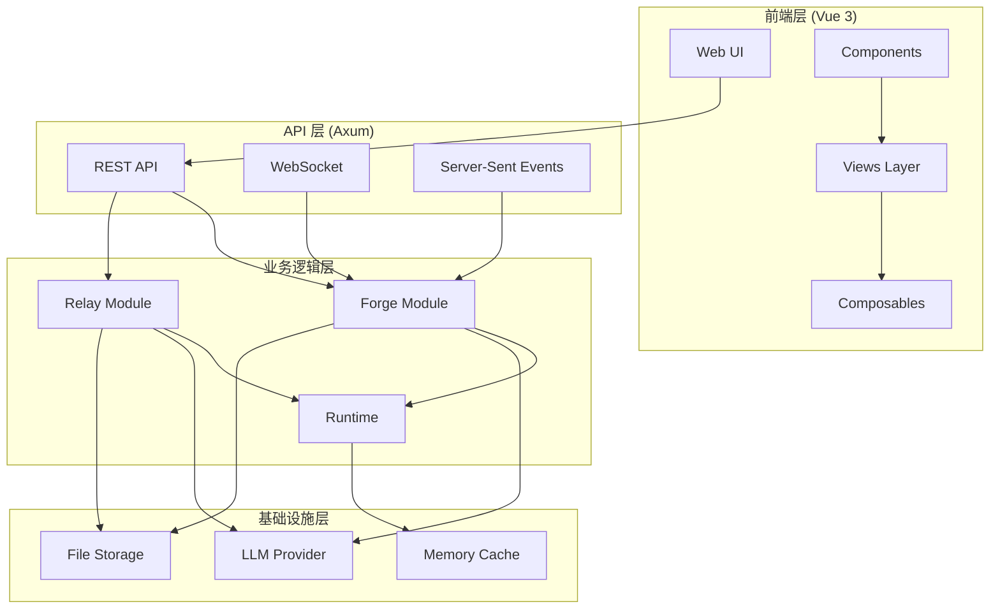
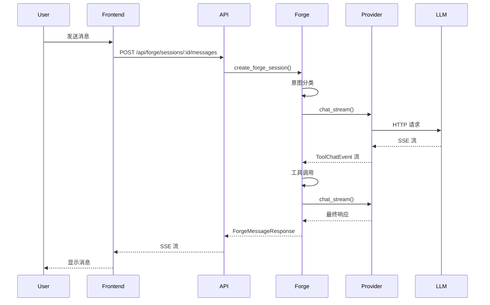
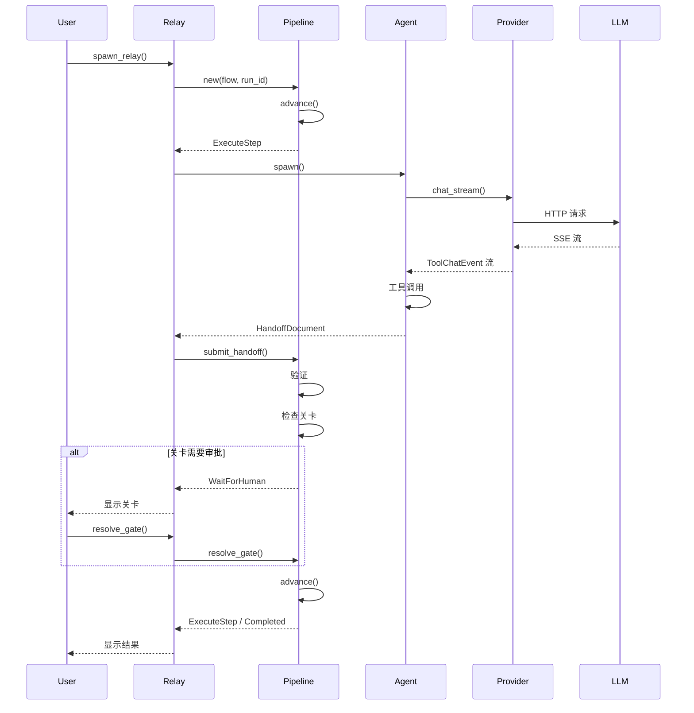
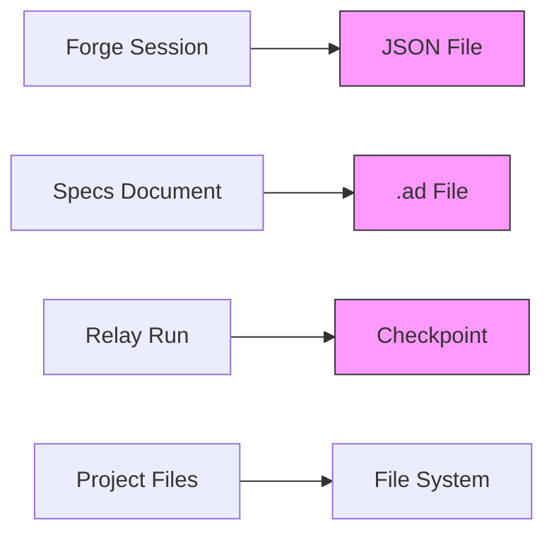

# AutoForge 架构设计

## 文档说明

本文档详细说明 AutoForge 的系统架构设计，包括模块划分、数据流、设计决策和技术选型。

**文档信息**
- **生成时间**: 2025-01-19
- **分析深度**: 架构级
- **目标读者**: 架构师、高级开发者
- **参考代码**: 42 个源文件，约 15,000+ 行代码

---

## 目录

1. [架构概览](#架构概览)
2. [分层架构](#分层架构)
3. [核心模块](#核心模块)
4. [数据流设计](#数据流设计)
5. [设计决策](#设计决策)
6. [扩展性设计](#扩展性设计)

---

## 架构概览

### 系统架构图



### 架构原则

1. **关注点分离**: 前端、后端、AI 模型明确分离
2. **单一职责**: 每个模块职责明确
3. **依赖倒置**: 高层模块不依赖低层模块
4. **接口隔离**: 使用明确的 API 契约
5. **开闭原则**: 对扩展开放，对修改关闭

---

## 分层架构

### 1. 前端层 (Frontend Layer)

#### 技术栈
- **框架**: Vue 3 (Composition API)
- **构建工具**: Vite 6.x
- **状态管理**: Composables (无额外状态库)
- **UI 组件**: 自定义组件 + TipTap (富文本编辑器)

#### 模块划分

**Views 层** (页面视图)
```typescript
// src/views/ChatView.vue
// 聊天界面，显示对话历史和工具调用
export default {
  setup() {
    const { messages, sendMessage } = useForge()
    return { messages, sendMessage }
  }
}
```

**Components 层** (可复用组件)
```typescript
// src/components/SpecItem.vue
// 规格项显示和编辑组件
export default {
  props: ['spec', 'editable'],
  emits: ['update', 'delete']
}
```

**Composables 层** (状态管理)
```typescript
// src/composables/useForge.ts
// Forge 状态管理
export function useForge() {
  const sessions = ref<ForgeSession[]>([])
  const currentSession = ref<ForgeSession | null>(null)
  
  async function sendMessage(content: string) {
    // 调用 API
  }
  
  return { sessions, currentSession, sendMessage }
}
```

#### 前端架构特点

- **响应式状态**: 使用 Vue 3 Reactive System
- **实时通信**: WebSocket + Server-Sent Events
- **流式渲染**: Markstream 用于 Markdown 流式渲染
- **协作编辑**: Yjs + TipTap (未来功能)

### 2. API 层 (API Layer)

#### 技术栈
- **框架**: Axum 0.8 (基于 Tokio)
- **路由**: RESTful API
- **实时通信**: WebSocket + SSE
- **中间件**: CORS, 静态文件服务

#### API 设计

**Forge API** (`backend/src/forge/mod.rs`)
```rust
// 文件: backend/src/forge/mod.rs | 行: 2024-2076
pub async fn create_forge_session(
    State(state): State<AppState>,
    Json(req): Json<CreateForgeSessionRequest>,
) -> Json<ForgeSession> {
    let session = ForgeSession::new(req.project, req.title);
    // 保存会话...
    Json(session)
}
```

**Relay API** (`backend/src/relay/api.rs`)
```rust
// 文件: backend/src/relay/api.rs | 行: 285-350
pub async fn start_run_handler(
    State(state): State<Arc<RelayState>>,
    Json(req): Json<StartRunRequest>,
) -> Result<Json<StartRunResponse>, StatusCode> {
    let flow = get_flow(&req.flow_id).ok_or(StatusCode::NOT_FOUND)?;
    let run_id = uuid::Uuid::new_v4().to_string();
    // 启动 Relay 运行...
}
```

#### API 端点组织

| 路径 | 方法 | 模块 | 说明 |
|------|------|------|------|
| `/api/forge/sessions` | POST | Forge | 创建会话 |
| `/api/forge/sessions/:id/messages` | POST | Forge | 发送消息 |
| `/api/forge/sessions/:id/stream` | GET | Forge | SSE 流 |
| `/api/forge/specs/:project` | GET/PUT | Forge | 规格管理 |
| `/api/relay/runs` | POST | Relay | 启动 Relay |
| `/api/relay/runs/:id/advance` | POST | Relay | 推进运行 |
| `/api/relay/runs/:id/gate` | POST | Relay | 解决关卡 |

### 3. 业务逻辑层 (Business Logic Layer)

#### Forge 模块

**职责**: 聊天循环、工具定义、规格管理

**核心组件**:
```rust
// 文件: backend/src/forge/mod.rs | 行: 34-50
pub struct ForgeSession {
    pub id: String,
    pub project: String,
    pub title: String,
    pub messages: Vec<ForgeMessage>,
    pub status: ForgeStatus,
    pub created_at: u64,
    pub updated_at: u64,
}
```

**工具系统**:
```rust
// 文件: backend/src/forge/tools.rs | 行: 128-173
pub struct ToolRegistry {
    tools: HashMap<String, Box<dyn Tool>>,
}

impl ToolRegistry {
    pub fn register(&mut self, tool: Box<dyn Tool>) {
        let name = tool.name().to_string();
        self.tools.insert(name, tool);
    }
}
```

#### Relay 模块

**职责**: 智能体编排、流水线执行、检查点管理

**核心组件**:
```rust
// 文件: backend/src/relay/pipeline.rs | 行: 79-135
pub struct PipelineEngine {
    pub flow: FlowSpec,
    pub current_step: usize,
    pub status: PipelineStatus,
    pub step_history: Vec<StepRecord>,
    pub loop_counters: HashMap<String, u32>,
    pub pending_gate: Option<PendingGate>,
    pub gate_feedback: HashMap<String, Vec<String>>,
    pub cumulative_tokens: u64,
    pub budget_tracker: BudgetTracker,
    pub mode: RelayMode,
}
```

**智能体实例**:
```rust
// 文件: backend/src/relay/agent.rs | 行: 106-173
pub struct AgentInstance {
    pub id: String,
    pub profession: Profession,
    pub soul: SoulConfig,
    pub model: ModelConfig,
    pub context: AgentContext,
    pub display_name: String,
    pub skill_prompts: Vec<String>,
    pub skill_tools: Vec<String>,
    pub relay_mode: bool,
    pub thinking_enabled: bool,
    pub thinking_budget: u32,
}
```

#### Runtime 模块

**职责**: 运行时上下文、权限管理、会话存储

**权限系统**:
```rust
// 文件: backend/src/runtime/permission.rs | 行: 20-44
pub struct PermissionPolicy {
    mode: PermissionMode,
}

impl PermissionPolicy {
    pub fn check(&self, tool_name: &str, is_read_only: bool) -> PermissionDecision {
        match self.mode {
            PermissionMode::AllowAll => PermissionDecision::Allowed,
            PermissionMode::ReadOnly => {
                if is_read_only {
                    PermissionDecision::Allowed
                } else {
                    PermissionDecision::Denied("Write operations not allowed".to_string())
                }
            }
        }
    }
}
```

### 4. 基础设施层 (Infrastructure Layer)

#### Provider 模块

**职责**: LLM API 集成

**Claude Provider**:
```rust
// 文件: backend/src/provider/claude.rs | 行: 71-101
pub struct ClaudeProvider {
    api_key: Option<String>,
    base_url: String,
}

impl ClaudeProvider {
    pub async fn chat_stream(
        &self,
        request: ToolChatRequest,
    ) -> Result<Pin<Box<dyn Stream<Item = ToolChatEvent> + Send>>, ApiError> {
        // 实现流式聊天...
    }
}
```

#### 存储系统

**基于文件的存储**:
- 规格文档: `docs/specs/*.ad`
- 会话数据: `~/.local/share/autoforge/sessions/*.json`
- 检查点: `~/.local/share/autoforge/checkpoints/*/`
- 配置文件: `.autoforge/config.toml`

**内存缓存**:
```rust
// 文件: backend/src/cache.rs | 行: 48-142
pub struct Cache {
    data: Arc<Mutex<HashMap<CacheKey, CacheValue>>>,
}

impl Cache {
    pub async fn get(&self, key: CacheKey) -> Option<CacheValue> {
        let data = self.data.lock().await;
        data.get(&key).cloned()
    }
}
```

---

## 核心模块

### 1. Forge - 聊天循环引擎

#### 模块职责

1. **会话管理**: 创建、加载、保存聊天会话
2. **消息处理**: 接收用户消息，调用工具，返回响应
3. **工具调度**: 管理工具注册表，执行工具调用
4. **规格管理**: 读写规格文档
5. **项目浏览**: 浏览项目文件系统

#### 模块结构

```
forge/
├── mod.rs           # 主模块，2800+ 行
├── errand.rs       # Errand 会话
├── project.rs      # 项目管理
├── tools.rs        # 工具系统
├── wiki.rs         # Wiki 知识库
└── templates/      # 提示词模板
```

#### 关键设计

**工具注册机制**:
```rust
// 文件: backend/src/forge/tools.rs | 行: 158-173
pub fn register(&mut self, tool: Box<dyn Tool>) {
    let name = tool.name().to_string();
    self.tools.insert(name, tool);
}

pub fn get(&self, name: &str) -> Option<&dyn Tool> {
    self.tools.get(name).map(|b| b.as_ref())
}
```

**规格文档存储**:
```rust
// 文件: backend/src/forge/mod.rs | 行: 685-820
pub struct SpecsStore {
    projects: HashMap<String, SpecsDocument>,
}

impl SpecsStore {
    pub fn save_ad_format(&self, doc: &SpecsDocument, project_name: &str) {
        let path = format!("docs/specs/{}.ad", project_name);
        // 保存到文件...
    }
}
```

### 2. Relay - 智能体编排引擎

#### 模块职责

1. **流程定义**: 定义和管理流程规范
2. **智能体实例化**: 创建和管理智能体实例
3. **流水线执行**: 执行流程步骤，处理分支和循环
4. **关卡管理**: 管理人工审批关卡
5. **检查点系统**: 保存和恢复运行状态

#### 模块结构

```
relay/
├── mod.rs          # 主模块
├── agent.rs       # 智能体实例
├── api.rs         # REST API
├── budget.rs      # Token 预算
├── checkpoint.rs # 检查点系统
├── config.rs      # 配置管理
├── driver.rs      # 执行驱动
├── flow.rs        # 流程规范
├── flows.rs       # 内置流程
├── handoff.rs     # 交接文档
├── pipeline.rs    # 流水线引擎
├── profession.rs # 职业定义
├── skills.rs      # 技能系统
├── soul.rs        # 灵魂配置
├── store.rs       # 运行存储
├── title.rs       # 标题生成
└── turn.rs        # 智能体轮次
```

#### 关键设计

**流程规范**:
```rust
// 文件: backend/src/relay/flow.rs | 行: 11-33
pub struct FlowSpec {
    pub id: String,
    pub steps: Vec<FlowStep>,
}

pub struct FlowStep {
    pub id: String,
    pub profession_id: String,
    pub agent_config_id: Option<String>,
    pub gate: GateType,
    pub max_turns: Option<u32>,
    pub exit: ExitRouting,
    pub validators: Vec<StepValidator>,
    pub tool_guard: Option<ToolGuard>,
}
```

**流水线引擎**:
```rust
// 文件: backend/src/relay/pipeline.rs | 行: 185-268
pub fn advance(&mut self) -> AdvanceResult {
    match &self.status {
        PipelineStatus::Completed => return AdvanceResult::Completed,
        PipelineStatus::Failed { error } => {
            return AdvanceResult::Failed { error: error.clone() };
        }
        _ => {}
    }
    
    // 检查关卡...
    // 执行步骤...
}
```

### 3. Provider - LLM 集成层

#### 模块职责

1. **API 调用**: 调用 Claude/GPT API
2. **流式响应**: 处理 Server-Sent Events
3. **工具调用**: 实现工具调用协议
4. **错误处理**: 处理 API 错误和重试

#### 模块结构

```
provider/
├── mod.rs      # 主模块
├── claude.rs  # Claude API
├── sse.rs     # SSE 解析器
└── types.rs   # 类型定义
```

#### 关键设计

**流式响应处理**:
```rust
// 文件: backend/src/provider/claude.rs | 行: 113-223
pub async fn chat_stream(
    &self,
    request: ToolChatRequest,
) -> Result<Pin<Box<dyn Stream<Item = ToolChatEvent> + Send>>, ApiError> {
    let client = reqwest::Client::new();
    let response = client
        .post(&format!("{}/messages", self.base_url))
        .header("x-api-key", &self.api_key)
        .header("anthropic-version", "2023-06-01")
        .json(&request)
        .send()
        .await?;
    
    // 处理 SSE 流...
}
```

---

## 数据流设计

### 1. 聊天流程



### 2. Relay 流程



### 3. 数据存储流



---

## 设计决策

### 1. 为什么选择 Rust？

**优势**:
- **性能**: 高性能，低内存占用
- **并发**: Tokio 异步运行时
- **类型安全**: 编译时错误检查
- **生态系统**: Axum, Tokio, Serde 等优秀库

**权衡**:
- 学习曲线陡峭
- 编译时间较长

### 2. 为什么选择串行而非并行智能体？

**优势**:
- **Token 节省**: 节省约 5 倍 token 成本
- **上下文清晰**: 每个智能体只接收必要信息
- **易于调试**: 线性流程，问题定位简单

**权衡**:
- 执行时间较长（可接受）

### 3. 为什么使用文件存储而非数据库？

**优势**:
- **简单**: 无需额外依赖
- **可移植**: 易于版本控制
- **可读**: 人类可读的 Markdown/TOML

**权衡**:
- 并发性能较低
- 查询功能有限

### 4. 为什么使用 Axum 而非 Actix-web？

**优势**:
- **类型安全**: 提取器模式
- **现代**: 基于 Tokio
- **简洁**: API 设计清晰

**权衡**:
- 生态系统较小

### 5. 为什么使用 Vue 3 而非 React？

**优势**:
- **组合式 API**: 灵活的状态管理
- **性能**: 更小的包体积
- **TypeScript**: 良好的类型支持

**权衡**:
- 生态系统较小

---

## 扩展性设计

### 1. 插件系统

**工具插件**:
```rust
pub trait Tool: Send + Sync {
    fn name(&self) -> &str;
    fn description(&self) -> &str;
    fn parameters(&self) -> serde_json::Value;
    fn execute(&self, args: serde_json::Value) -> Result<String, ToolError>;
}
```

**技能插件**:
```rust
pub struct SkillDefinition {
    pub id: String,
    pub name: String,
    pub prompt_fragment: String,
    pub granted_tools: Vec<String>,
}
```

### 2. 自定义流程

支持通过 YAML 定义自定义流程:
```yaml
id: custom-flow
steps:
  - id: step1
    profession_id: architect
    gate: Auto
    exit: Next
```

### 3. 多模型支持

**Provider 接口**:
```rust
pub enum Provider {
    Anthropic,
    OpenAI,
    Local { url: String },
}
```

### 4. 分布式部署

**WebSocket 支持**:
```rust
// 文件: backend/src/main.rs | 行: 3-4
use axum::extract::ws::{WebSocket, WebSocketUpgrade};
```

---

## 性能考虑

### 1. 异步 I/O

使用 Tokio 异步运行时:
```rust
#[tokio::main]
async fn main() {
    // ...
}
```

### 2. 内存缓存

```rust
pub struct Cache {
    data: Arc<Mutex<HashMap<CacheKey, CacheValue>>>,
}
```

### 3. 流式响应

使用 SSE 减少延迟:
```rust
pub async fn forge_stream(
    ...,
) -> Sse<impl Stream<Item = Result<Event, Infallible>>> {
    // ...
}
```

---

## 安全考虑

### 1. API 密钥保护

- 环境变量存储
- 不记录到日志
- 不包含在错误信息中

### 2. 权限控制

```rust
pub enum PermissionMode {
    AllowAll,
    ReadOnly,
    DenyWrites,
}
```

### 3. 输入验证

```rust
pub fn validate_path(path: &str) -> Result<PathBuf, String> {
    // 防止路径遍历攻击
}
```

---

**文档生成器**: CodeViewX  
**最后更新**: 2025-01-19  
**文档版本**: 1.0.0
