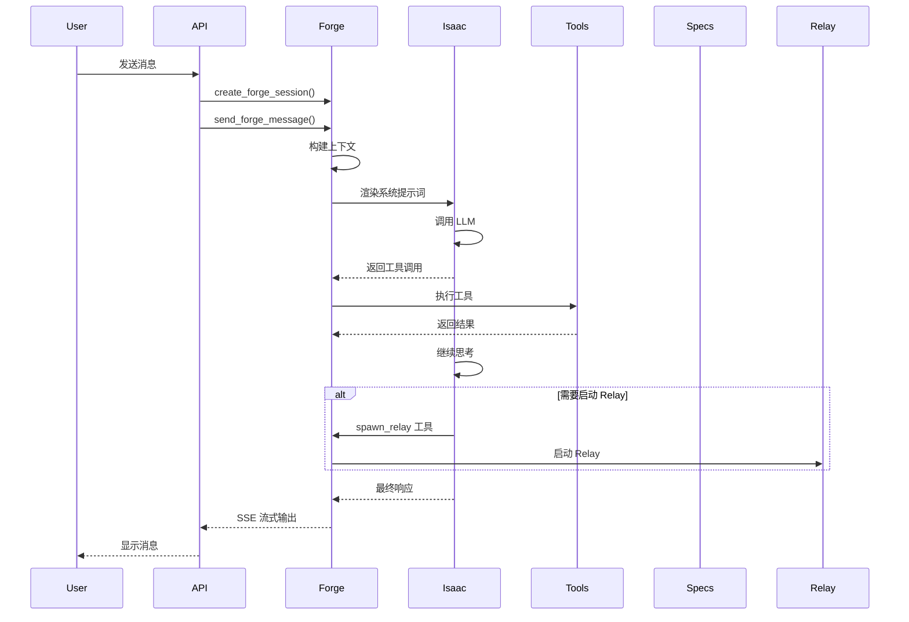
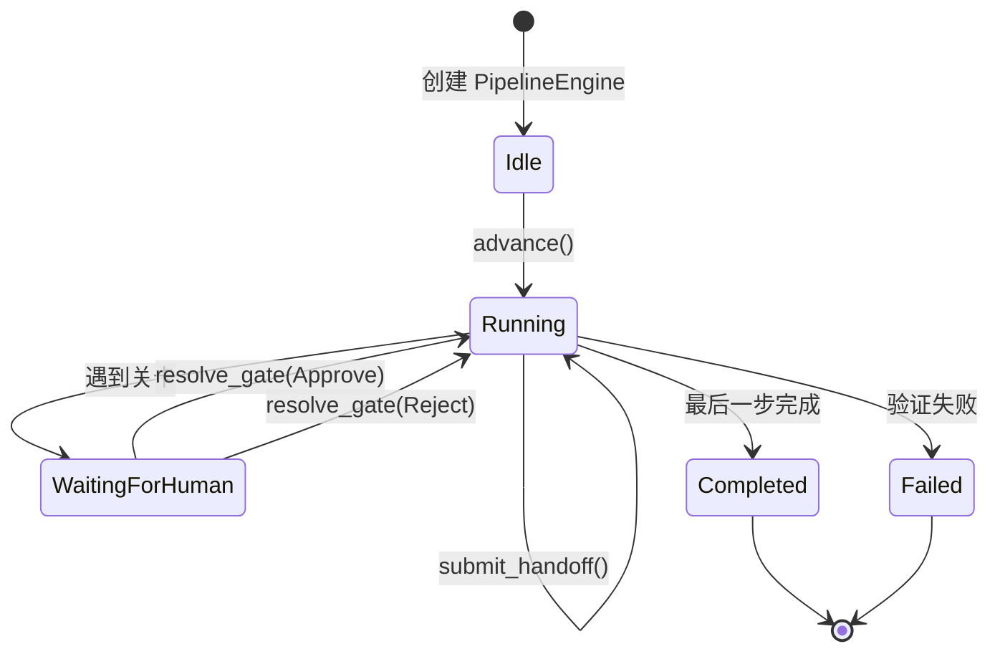
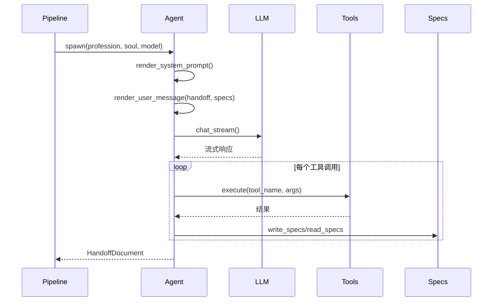
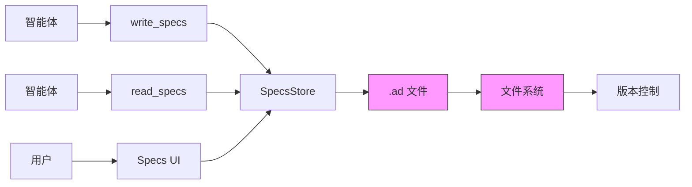
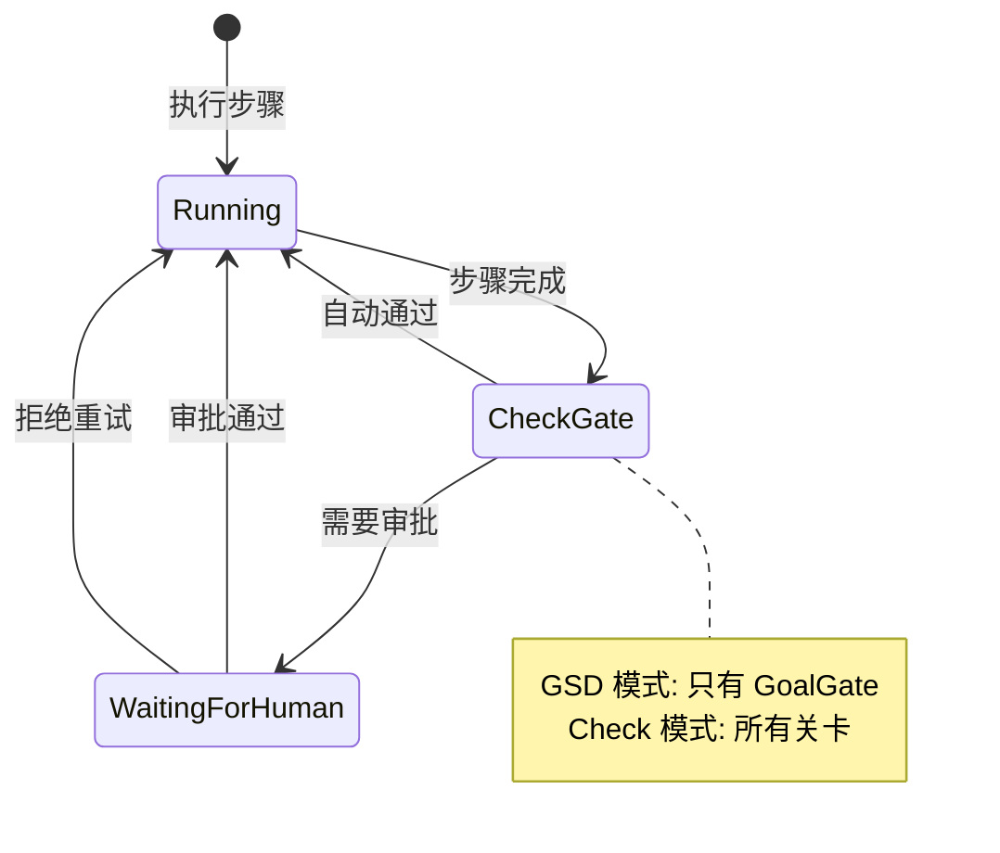

# AutoForge 核心工作机制

## 文档说明

本文档深入分析 AutoForge 的核心工作流程，包括流程引擎、智能体执行、规格管理和关卡系统。

**文档信息**
- **生成时间**: 2025-01-19
- **分析深度**: 实现级（包含代码示例）
- **目标读者**: 核心开发者、技术深度研究者
- **参考代码**: 精确到文件路径和行号

---

## 目录

1. [核心流程 #1: 聊天循环 (Forge)](#核心流程-1-聊天循环-forge)
2. [核心流程 #2: Relay 流水线执行](#核心流程-2-relay-流水线执行)
3. [核心流程 #3: 智能体轮次执行](#核心流程-3-智能体轮次执行)
4. [核心流程 #4: 规格文档管理](#核心流程-4-规格文档管理)
5. [核心流程 #5: 关卡系统](#核心流程-5-关卡系统)
6. [设计亮点](#设计亮点)

---

## 核心流程 #1: 聊天循环 (Forge)

### 概述

Forge 是 AutoForge 的聊天循环核心，负责接收用户消息、分类意图、调用工具、管理规格文档，并在必要时启动 Relay 流程。

**输入输出**:
- **输入**: 用户消息文本
- **输出**: 助手响应、工具调用结果、规格更新

### 流程图



### 详细步骤

#### 步骤 1: 创建 Forge 会话

**触发条件**: 用户创建新聊天会话

**核心代码**:
```rust
// 文件: backend/src/forge/mod.rs | 行: 2024-2076
pub async fn create_forge_session(
    State(state): State<AppState>,
    Json(req): Json<CreateForgeSessionRequest>,
) -> Json<ForgeSession> {
    let session = ForgeSession::new(req.project, req.title);
    
    // 保存会话到文件
    let sessions_dir = base_dir.join("sessions");
    let session_path = sessions_dir.join(format!("{}.json", &session.id));
    
    Json(session)
}
```

**数据流**:
1. 接收请求 `{ project: string, title: string }`
2. 创建 `ForgeSession` 实例
3. 生成 UUID 作为会话 ID
4. 保存到 `~/.local/share/autoforge/sessions/{id}.json`
5. 返回会话对象

**关键点**:
- 会话数据持久化到文件系统
- 支持项目关联（project 字段）
- 初始状态为 `Idle`

#### 步骤 2: 发送消息和意图分类

**触发条件**: 用户发送消息

**核心代码**:
```rust
// 文件: backend/src/forge/mod.rs | 行: 2082-2125
pub async fn send_forge_message(
    State(state): State<AppState>,
    Path(sid): Path<String>,
    Json(req): Json<SendMessageRequest>,
) -> Result<Json<ForgeMessageResponse>, (StatusCode, String)> {
    let session = load_session(&sid)?;
    
    // 添加用户消息
    let user_msg = ForgeMessage {
        role: "user".to_string(),
        content: req.content.clone(),
        timestamp: now_secs(),
        tool_calls: None,
    };
    session.messages.push(user_msg);
    
    // 构建上下文
    let context = build_context(&session);
    
    // 调用 Isaac（助手）
    let response = call_isaac(&context, &state.ai_provider).await?;
    
    Ok(Json(ForgeMessageResponse {
        message: response,
        session: session.clone(),
    }))
}
```

**数据流**:
1. 加载会话状态
2. 添加用户消息到历史
3. 构建上下文（包括项目规格、文件列表等）
4. 调用 Isaac（助手智能体）
5. 返回响应

**关键点**:
- 上下文包含项目规格摘要
- 支持流式响应（SSE）
- Isaac 负责意图分类

#### 步骤 3: 工具调用执行

**触发条件**: Isaac 决定调用工具

**核心代码**:
```rust
// 文件: backend/src/forge/tools.rs | 行: 94-116
impl ToolRegistry {
    pub async fn execute(
        &self,
        tool_name: &str,
        args: serde_json::Value,
    ) -> Result<String, ToolError> {
        let tool = self.get(tool_name)
            .ok_or_else(|| ToolError::ToolNotFound(tool_name.to_string()))?;
        
        // 检查权限
        let is_read_only = tool.is_read_only();
        let decision = PERMISSION_POLICY.check(tool_name, is_read_only);
        
        if let PermissionDecision::Denied(reason) = decision {
            return Err(ToolError::PermissionDenied(reason));
        }
        
        // 执行工具
        tool.execute(args).await
    }
}
```

**数据流**:
1. 查找工具定义
2. 检查权限（读/写）
3. 解析参数
4. 执行工具逻辑
5. 返回结果

**关键点**:
- 权限系统阻止未授权操作
- 工具可以是文件操作、规格更新等
- 错误处理和重试机制

#### 步骤 4: 启动 Relay 流程

**触发条件**: Isaac 调用 `spawn_relay` 工具

**核心代码**:
```rust
// 文件: backend/src/relay/api.rs | 行: 285-350
pub async fn start_run_handler(
    State(state): State<Arc<RelayState>>,
    Json(req): Json<StartRunRequest>,
) -> Result<Json<StartRunResponse>, StatusCode> {
    // 获取流程定义
    let flow = get_flow(&req.flow_id)
        .ok_or(StatusCode::NOT_FOUND)?;
    
    // 创建运行状态
    let run_id = uuid::Uuid::new_v4().to_string();
    let mut pipeline = PipelineEngine::new(flow, run_id.clone());
    pipeline.mode = req.mode;
    
    // 保存运行
    let entry = RunEntry {
        run_id: run_id.clone(),
        flow_id: req.flow_id,
        status: RunStatus::Running,
        created_at: now_secs(),
    };
    save_run(&entry);
    
    // 启动后台任务
    tokio::spawn(async move {
        drive_run(pipeline, &state.ai_provider).await;
    });
    
    Ok(Json(StartRunResponse { run_id }))
}
```

**数据流**:
1. 接收 Relay 请求（流程 ID、模式等）
2. 创建 `PipelineEngine` 实例
3. 保存初始运行状态
4. 启动后台任务执行流程
5. 返回运行 ID

**关键点**:
- 异步执行，不阻塞聊天
- 支持两种模式（GSD、Check）
- 运行状态持久化

### 异常处理

- **工具执行失败**: 返回错误消息给 Isaac，Isaac 可以重试
- **LLM API 错误**: 自动重试，最多 3 次
- **文件系统错误**: 返回用户友好的错误消息

### 设计亮点

1. **流式响应**: 使用 SSE 实现实时反馈
2. **工具可扩展**: 通过 Trait 定义新工具
3. **权限控制**: 细粒度的读/写权限
4. **上下文管理**: 自动压缩和摘要

---

## 核心流程 #2: Relay 流水线执行

### 概述

Relay 是 AutoForge 的智能体编排引擎，通过状态机执行流程规范，处理分支、循环和关卡。

**输入输出**:
- **输入**: 流程规范（FlowSpec）、运行模式（GSD/Check）
- **输出**: 完成的规格文档、代码文件、检查点

### 流程图



### 详细步骤

#### 步骤 1: 初始化流水线

**触发条件**: 用户或工具调用启动 Relay

**核心代码**:
```rust
// 文件: backend/src/relay/pipeline.rs | 行: 149-193
pub fn new(flow: FlowSpec, run_id: impl Into<String>) -> Self {
    Self::with_budget(flow, run_id, TokenBudget::new(10_000_000))
}

pub fn with_budget(flow: FlowSpec, run_id: impl Into<String>, run_budget: TokenBudget) -> Self {
    Self {
        flow,
        current_step: 0,
        status: PipelineStatus::Idle,
        run_id: run_id.into(),
        step_history: Vec::new(),
        loop_counters: HashMap::new(),
        pending_gate: None,
        gate_feedback: HashMap::new(),
        gate_resolved_for_step: None,
        cumulative_tokens: 0,
        budget_tracker: BudgetTracker::new(run_budget),
        mode: RelayMode::GSD,
    }
}
```

**数据流**:
1. 接收流程规范
2. 创建 `PipelineEngine` 实例
3. 初始化状态为 `Idle`
4. 设置预算追踪器

**关键点**:
- 支持自定义 Token 预算
- 默认 GSD 模式
- 初始化循环计数器和反馈存储

#### 步骤 2: 推进流水线

**触发条件**: 调用 `advance()` 方法

**核心代码**:
```rust
// 文件: backend/src/relay/pipeline.rs | 行: 185-268
pub fn advance(&mut self) -> AdvanceResult {
    match &self.status {
        PipelineStatus::Completed => return AdvanceResult::Completed,
        PipelineStatus::Failed { error } => {
            return AdvanceResult::Failed { error: error.clone() };
        }
        PipelineStatus::WaitingForHuman { .. } => {
            return AdvanceResult::Failed {
                error: "Cannot advance while waiting for human gate".into(),
            };
        }
        _ => {}
    }
    
    // 检查是否完成所有步骤
    if self.current_step >= self.flow.steps.len() {
        self.status = PipelineStatus::Completed;
        return AdvanceResult::Completed;
    }
    
    let step = &self.flow.steps[self.current_step];
    
    // 检查关卡
    if step.gate == GateType::Human
        && self.gate_resolved_for_step.as_ref() != Some(&step.id)
        && self.mode == RelayMode::Check
    {
        self.status = PipelineStatus::WaitingForHuman {
            gate: GateType::Human,
            step_id: step.id.clone(),
            since: now_secs(),
        };
        return AdvanceResult::WaitForHuman {
            gate: GateType::Human,
            step_id: step.id.clone(),
        };
    }
    
    // 转换到 Running 状态
    self.status = PipelineStatus::Running {
        step_id: step.id.clone(),
        profession_id: step.profession_id.clone(),
        started_at: now_secs(),
    };
    
    AdvanceResult::ExecuteStep {
        step_id: step.id.clone(),
        profession_id: step.profession_id.clone(),
        agent_config_id: step.agent_config_id.clone(),
    }
}
```

**数据流**:
1. 检查当前状态（已完成/失败/等待）
2. 检查是否超出步骤数
3. 检查关卡条件
4. 转换到 `Running` 状态
5. 返回执行指令

**关键点**:
- 状态机确保正确的转换
- 关卡检查根据模式决定
- 返回下一步执行指令

#### 步骤 3: 提交接力文档

**触发条件**: 智能体完成工作

**核心代码**:
```rust
// 文件: backend/src/relay/pipeline.rs | 行: 269-413
pub fn submit_handoff(&mut self, handoff: HandoffDocument) -> AdvanceResult {
    let now = now_secs();
    
    // 记录完成的步骤
    let step_id = match &self.status {
        PipelineStatus::Running { step_id, .. } => step_id.clone(),
        _ => {
            self.status = PipelineStatus::Failed {
                error: "submit_handoff called but no step is running".into(),
            };
            return self.advance();
        }
    };
    
    let profession_id = self.flow.steps[self.current_step].profession_id.clone();
    
    self.step_history.push(StepRecord {
        step_id: step_id.clone(),
        profession_id: profession_id.clone(),
        handoff: Some(handoff.clone()),
        started_at: 0,
        completed_at: now,
        iteration: *self.loop_counters.get(&step_id).unwrap_or(&0),
    });
    
    // 更新累计 tokens
    let step_tokens = handoff.token_usage.step_input + handoff.token_usage.step_output;
    self.cumulative_tokens += step_tokens;
    
    // 检查预算
    match self.budget_tracker.check(&profession_id) {
        BudgetAction::HardStop => {
            self.status = PipelineStatus::Failed {
                error: format!("Budget exceeded"),
            };
            return AdvanceResult::Failed { error: "Budget exceeded".into() };
        }
        _ => {}
    }
    
    // 自动验证
    if let Some(fail_reason) = self.validate_step(&step_id, &handoff) {
        // 处理验证失败...
    }
    
    // 解析下一步
    let exit = self.flow.steps[self.current_step].exit.clone();
    let next_index = self.resolve_next_step(&step_id, &exit, &handoff);
    
    match next_index {
        NextStep::Index(idx) => {
            self.current_step = idx;
            self.advance()
        }
        NextStep::Complete => {
            self.current_step = self.flow.steps.len();
            self.status = PipelineStatus::Completed;
            AdvanceResult::Completed
        }
        NextStep::Error(msg) => {
            self.status = PipelineStatus::Failed { error: msg };
            AdvanceResult::Failed { error: msg }
        }
    }
}
```

**数据流**:
1. 验证当前状态
2. 记录步骤历史
3. 更新 Token 使用
4. 检查预算
5. 验证步骤输出
6. 解析下一步路由
7. 转换状态并推进

**关键点**:
- 自动验证确保输出质量
- 预算检查防止成本失控
- 路由解析支持分支和循环

#### 步骤 4: 解决关卡

**触发条件**: 人工审批或拒绝

**核心代码**:
```rust
// 文件: backend/src/relay/pipeline.rs | 行: 414-445
pub fn resolve_gate(&mut self, decision: GateDecision) -> AdvanceResult {
    let pending = match self.pending_gate.take() {
        Some(g) => g,
        None => {
            return AdvanceResult::Failed {
                error: "No pending gate to resolve".into(),
            };
        }
    };
    
    match decision {
        GateDecision::Approve | GateDecision::Edit { .. } => {
            self.gate_resolved_for_step = Some(pending.step_id.clone());
            self.status = PipelineStatus::Idle;
            self.advance()
        }
        GateDecision::Reject { feedback } => {
            self.gate_feedback
                .entry(pending.step_id.clone())
                .or_default()
                .push(feedback);
            self.gate_resolved_for_step = Some(pending.step_id.clone());
            self.status = PipelineStatus::Idle;
            self.advance()
        }
    }
}
```

**数据流**:
1. 检查有待处理的关卡
2. 处理审批决策
3. 存储反馈（如果拒绝）
4. 标记关卡已解决
5. 推进流水线

**关键点**:
- 拒绝时存储反馈给智能体
- 审批后继续执行
- 支持编辑决策

### 异常处理

- **验证失败**: 自动重试，最多 3 次
- **预算超限**: 硬停止，拒绝继续
- **关卡超时**: 可配置超时时间

### 设计亮点

1. **纯代码编排**: 零 LLM token 用于流程控制
2. **状态机清晰**: 易于调试和监控
3. **自动验证**: 确保输出质量
4. **预算控制**: 防止成本失控

---

## 核心流程 #3: 智能体轮次执行

### 概述

智能体轮次是单个智能体执行一个步骤的过程，包括渲染提示词、调用 LLM、执行工具、生成交接文档。

**输入输出**:
- **输入**: 步骤定义、交接摘要、规格摘要
- **输出**: 交接文档（HandoffDocument）

### 流程图



### 详细步骤

#### 步骤 1: 实例化智能体

**触发条件**: 流水线决定执行步骤

**核心代码**:
```rust
// 文件: backend/src/relay/agent.rs | 行: 129-151
pub fn spawn(
    profession: Profession,
    soul: SoulConfig,
    model: ModelConfig,
) -> Self {
    let display_name = profession.name.clone();
    Self {
        id: format!("agent-{}", uuid::Uuid::new_v4()),
        profession: profession.clone(),
        soul,
        model,
        context: AgentContext::default(),
        display_name,
        skill_prompts: Vec::new(),
        skill_tools: Vec::new(),
        relay_mode: false,
        thinking_enabled: profession.thinking_enabled,
        thinking_budget: profession.thinking_budget,
    }
}
```

**数据流**:
1. 接收职业、灵魂、模型配置
2. 生成唯一 ID
3. 初始化上下文
4. 配置思考模式

**关键点**:
- 智能体是短暂实例
- 每个步骤创建新实例
- 支持技能附加

#### 步骤 2: 渲染系统提示词

**触发条件**: 智能体准备调用 LLM

**核心代码**:
```rust
// 文件: backend/src/relay/agent.rs | 行: 193-308
pub fn render_system_prompt(&self) -> String {
    let mut parts = Vec::new();
    
    // 身份
    parts.push(format!(
        "You are {}, an AI coding assistant.\n",
        self.display_name
    ));
    
    // 灵魂
    parts.push(self.soul.render());
    
    // 职业
    parts.push(format!(
        "## Profession: {}\n\nYour role is {}. Your phase is {}.\n",
        self.profession.name,
        self.profession.name,
        self.profession.phase.as_str()
    ));
    
    // 拥有的区块
    if !self.profession.owned_sections.is_empty() {
        let sections: Vec<String> = self.profession.owned_sections.iter()
            .map(|s| s.as_str().to_string())
            .collect();
        parts.push(format!(
            "You OWN these spec sections: {}\n",
            sections.join(", ")
        ));
    }
    
    // 工具权限
    if !self.profession.allowed_tools.is_empty() {
        parts.push(format!(
            "You may use these tools: {}\n",
            self.profession.allowed_tools.join(", ")
        ));
    }
    
    // 技能
    for prompt in &self.skill_prompts {
        parts.push(prompt.clone());
    }
    
    // 约束
    parts.push(format!(
        "\n## Constraints\n- Max turns: {}\n- Token budget: {}\n",
        self.profession.max_turns,
        self.profession.token_budget
    ));
    
    parts.join("\n")
}
```

**数据流**:
1. 组装身份信息
2. 附加灵魂价值观
3. 添加职业职责
4. 列出拥有的规格区块
5. 列出可用工具
6. 附加技能提示
7. 添加约束条件

**关键点**:
- 灵魂定义个性和价值观
- 职业定义职责和权限
- 约束控制行为

#### 步骤 3: 执行轮次

**触发条件**: 智能体准备执行任务

**核心代码**:
```rust
// 文件: backend/src/relay/turn.rs | 行: 123-401
pub async fn run(
    &mut self,
    tools: Vec<ToolDefinition>,
    handoff_summary: &str,
    spec_summary: &str,
) -> Result<TurnResult, TurnError> {
    let mut messages = Vec::new();
    let mut tool_calls = Vec::new();
    let mut turn_count = 0;
    
    // 构建请求
    let request = self.agent.build_chat_request(
        tools.clone(),
        handoff_summary,
        spec_summary,
    );
    
    // 开始循环
    loop {
        turn_count += 1;
        
        // 检查约束
        if turn_count > self.agent.profession.max_turns {
            return Err(TurnError::MaxTurnsExceeded);
        }
        
        // 调用 LLM
        let response = self.provider.chat_stream(request.clone()).await?;
        
        // 处理流式事件
        let mut current_content = String::new();
        let mut current_tool_calls = Vec::new();
        
        pin_mut!(response);
        while let Some(event) = response.next().await {
            match event {
                ToolChatEvent::ContentBlockDelta { delta, .. } => {
                    current_content.push_str(&delta.text);
                }
                ToolChatEvent::ToolUse(tool_use) => {
                    current_tool_calls.push(tool_use);
                }
                ToolChatEvent::MessageStop => {
                    break;
                }
            }
        }
        
        // 保存消息
        messages.push(ChatMessage {
            role: "assistant".to_string(),
            content: current_content.clone(),
            tool_calls: current_tool_calls.clone(),
        });
        
        // 执行工具调用
        for tool_call in &current_tool_calls {
            let result = self.execute_tool(&tool_call).await?;
            tool_calls.push(ToolCallRecord {
                name: tool_call.name.clone(),
                input: tool_call.input.clone(),
                output: result,
            });
        }
        
        // 如果没有工具调用，结束
        if current_tool_calls.is_empty() {
            break;
        }
    }
    
    Ok(TurnResult {
        messages,
        tool_calls,
        turn_count,
    })
}
```

**数据流**:
1. 构建初始请求
2. 进入轮次循环
3. 调用 LLM API
4. 处理流式响应
5. 执行工具调用
6. 重复直到无工具调用

**关键点**:
- 支持多轮对话
- 流式响应减少延迟
- 工具调用集成
- 约束检查

#### 步骤 4: 生成交接文档

**触发条件**: 轮次完成

**核心代码**:
```rust
// 文件: backend/src/relay/turn.rs | 行: 402-523
pub fn to_handoff(&self, turn_result: TurnResult, from: &str, to: &str) -> HandoffDocument {
    let mut handoff = HandoffDocument::new(from, to, &self.run_id, self.checkpoint_id);
    
    // 提取决策
    for msg in &turn_result.messages {
        if msg.content.contains("DECISION:") {
            // 解析决策...
        }
    }
    
    // 提取工作产品
    for tool_call in &turn_result.tool_calls {
        if tool_call.name == "write_file" || tool_call.name == "edit_file" {
            if let Ok(path) = serde_json::from_str::<serde_json::Value>(&tool_call.input) {
                handoff.work_product.push(WorkProduct {
                    path: path["path"].as_str().unwrap().to_string(),
                    description: "Generated file".to_string(),
                });
            }
        }
    }
    
    // 提取规格更新
    for tool_call in &turn_result.tool_calls {
        if tool_call.name == "write_specs" || tool_call.name == "update_spec" {
            // 解析规格更新...
        }
    }
    
    // 计算 Token 使用
    handoff.token_usage = TokenUsage {
        step_input: self.estimate_input_tokens(&turn_result),
        step_output: self.estimate_output_tokens(&turn_result),
        cumulative: 0,
        budget_remaining: 0,
    };
    
    handoff
}
```

**数据流**:
1. 创建空交接文档
2. 提取决策点
3. 提取工作产品
4. 提取规格更新
5. 计算 Token 使用
6. 返回交接文档

**关键点**:
- 结构化提取关键信息
- Token 估算
- 可追溯性

### 异常处理

- **工具执行失败**: 记录错误，继续执行
- **LLM API 错误**: 重试，最多 3 次
- **超时**: 可配置超时时间

### 设计亮点

1. **多轮对话**: 支持复杂任务
2. **流式响应**: 实时反馈
3. **工具集成**: 无缝工具调用
4. **约束执行**: 控制行为

---

## 核心流程 #4: 规格文档管理

### 概述

规格是 AutoForge 的唯一真实来源，包括 7 类规格文档，支持双向可追溯性。

**规格类型**:
1. **Goals** (G1, G2, ...): 项目目标
2. **Architecture** (A1, A2, ...): 架构设计
3. **Designs** (D1, D2, ...): 详细设计
4. **Plans** (P1, P2, ...): 实施计划
5. **Tests** (S1.1, S1.2, ...): 测试规格
6. **Reviews** (V1, V2, ...): 评审记录
7. **Reports** (X42, X43, ...): 最终报告

### 流程图



### 详细步骤

#### 步骤 1: 创建规格文档

**触发条件**: 智能体调用 `write_specs` 工具

**核心代码**:
```rust
// 文件: backend/src/forge/mod.rs | 行: 1306-1350
pub fn save_ad_format(&self, doc: &SpecsDocument, project_name: &str) {
    let mut content = String::new();
    
    // 写入头部
    content.push_str(&format!("# Project: {}\n\n", project_name));
    
    // 写入每个区块
    for (section_type, items) in &doc.sections {
        for item in items {
            content.push_str(&format!("## {} {}\n\n", section_type.as_str(), item.id));
            content.push_str(&item.content);
            content.push_str("\n\n");
        }
    }
    
    // 保存到文件
    let specs_dir = std::path::PathBuf::from("docs/specs");
    let file_path = specs_dir.join(format!("{}.ad", project_name));
    
    std::fs::write(&file_path, content).expect("Failed to write specs");
}
```

**数据流**:
1. 接收规格文档对象
2. 格式化为 `.ad` 格式
3. 写入 `docs/specs/` 目录
4. 文件持久化

**关键点**:
- 人类可读的 Markdown 格式
- 支持版本控制
- 结构化区块

#### 步骤 2: 读取规格文档

**触发条件**: 智能体调用 `read_specs` 工具

**核心代码**:
```rust
// 文件: backend/src/forge/mod.rs | 行: 1351-1461
pub fn load_ad_format(project_name: &str) -> Result<Self, std::io::Error> {
    let specs_dir = std::path::PathBuf::from("docs/specs");
    let file_path = specs_dir.join(format!("{}.ad", project_name));
    
    let content = std::fs::read_to_string(&file_path)?;
    
    // 解析内容
    let mut doc = SpecsDocument::new();
    let mut current_section = None;
    
    for line in content.lines() {
        if line.starts_with("## ") {
            let section_part = line[3..].to_string();
            // 解析区块类型和 ID...
        } else {
            // 添加内容到当前项...
        }
    }
    
    Ok(doc)
}
```

**数据流**:
1. 读取 `.ad` 文件
2. 解析区块和项
3. 构建 `SpecsDocument` 对象
4. 返回结构化数据

**关键点**:
- 解析 Markdown 格式
- 提取 ID 和内容
- 关联关系

#### 步骤 3: 更新规格状态

**触发条件**: 智能体调用 `update_spec` 工具

**核心代码**:
```rust
// 文件: backend/src/forge/mod.rs | 行: 2945-2964
pub async fn update_specs_section(
    Path(project): Path<String>,
    Json(req): Json<UpdateSpecSectionRequest>,
) -> Result<Json<SpecsDocument>, (StatusCode, String)> {
    let mut store = specs_store();
    let doc = store.get_or_default(&project);
    
    // 查找并更新项
    for section in doc.sections.values_mut() {
        for item in section.iter_mut() {
            if item.id == req.spec_id {
                item.content = req.content;
                item.status = Status::from_str_lossy(&req.status);
                item.updated_at = now_secs();
                return Ok(Json(doc.clone()));
            }
        }
    }
    
    Err((StatusCode::NOT_FOUND, "Spec not found".to_string()))
}
```

**数据流**:
1. 接收更新请求
2. 查找规格项
3. 更新内容和状态
4. 保存到存储
5. 返回更新后的文档

**关键点**:
- 原子更新
- 状态转换验证
- 时间戳记录

### 异常处理

- **文件不存在**: 返回空文档
- **解析错误**: 跳过无效行
- **权限错误**: 返回错误消息

### 设计亮点

1. **人类可读**: Markdown 格式
2. **版本控制友好**: 文本文件
3. **双向追溯**: ID 关联
4. **状态管理**: 生命周期跟踪

---

## 核心流程 #5: 关卡系统

### 概述

关卡系统是人工审批检查站，用于关键决策点的人工干预。

**关卡类型**:
1. **GoalGate**: Advisor → Architect 边界（必须审批）
2. **其他关卡**: 根据模式决定

**两种模式**:
- **GSD 模式**: 只有 GoalGate 需要审批
- **Check 模式**: 所有关卡都需要审批

### 流程图



### 详细步骤

#### 步骤 1: 检查关卡

**触发条件**: 步骤完成，调用 `advance()`

**核心代码**:
```rust
// 文件: backend/src/relay/pipeline.rs | 行: 214-268
// 检查关卡
if step.gate == GateType::Human
    && self.gate_resolved_for_step.as_ref() != Some(&step.id)
    && self.mode == RelayMode::Check
{
    // Check 模式: 所有关卡都暂停
    self.status = PipelineStatus::WaitingForHuman {
        gate: GateType::Human,
        step_id: step.id.clone(),
        since: now_secs(),
    };
    return AdvanceResult::WaitForHuman {
        gate: GateType::Human,
        step_id: step.id.clone(),
    };
}

// GSD 模式: 只有 Advisor 关卡暂停
if step.gate == GateType::Human
    && self.gate_resolved_for_step.as_ref() != Some(&step.id)
    && self.mode == RelayMode::GSD
    && step.profession_id == "advisor"
{
    self.status = PipelineStatus::WaitingForHuman {
        gate: GateType::Human,
        step_id: step.id.clone(),
        since: now_secs(),
    };
    return AdvanceResult::WaitForHuman {
        gate: GateType::Human,
        step_id: step.id.clone(),
    };
}
```

**数据流**:
1. 检查步骤是否有关卡
2. 检查模式（GSD/Check）
3. 检查是否已解决
4. 转换到等待状态
5. 返回等待指令

**关键点**:
- GSD 模式只暂停 Advisor
- Check 模式暂停所有关卡
- 已解决的关卡自动通过

#### 步骤 2: 人工审批

**触发条件**: 用户在 UI 中审批或拒绝

**核心代码**:
```rust
// 文件: backend/src/relay/pipeline.rs | 行: 414-445
pub fn resolve_gate(&mut self, decision: GateDecision) -> AdvanceResult {
    let pending = match self.pending_gate.take() {
        Some(g) => g,
        None => {
            return AdvanceResult::Failed {
                error: "No pending gate to resolve".into(),
            };
        }
    };
    
    match decision {
        GateDecision::Approve | GateDecision::Edit { .. } => {
            self.gate_resolved_for_step = Some(pending.step_id.clone());
            self.status = PipelineStatus::Idle;
            self.advance()
        }
        GateDecision::Reject { feedback } => {
            self.gate_feedback
                .entry(pending.step_id.clone())
                .or_default()
                .push(feedback);
            self.gate_resolved_for_step = Some(pending.step_id.clone());
            self.status = PipelineStatus::Idle;
            self.advance()
        }
    }
}
```

**数据流**:
1. 检查有待处理的关卡
2. 处理审批决策
3. 存储反馈（如果拒绝）
4. 标记关卡已解决
5. 推进流水线

**关键点**:
- 审批通过继续执行
- 拒绝时重试步骤
- 反馈传递给智能体

### 异常处理

- **无待处理关卡**: 返回错误
- **超时**: 可配置超时时间

### 设计亮点

1. **人在回路**: 关键决策点人工干预
2. **灵活模式**: GSD 和 Check 两种模式
3. **反馈机制**: 拒绝时提供反馈
4. **状态清晰**: 明确的等待状态

---

## 设计亮点

### 1. 规格驱动

- **唯一真实来源**: 规格是协作的基础
- **类型化 ID**: G1, A1, D1 等，易于引用
- **双向追溯**: 决策点和工作产品关联

### 2. 串行智能体

- **Token 节省**: 相比并行节省约 5 倍
- **上下文清晰**: 每个智能体只接收必要信息
- **易于调试**: 线性流程

### 3. 持久化执行

- **检查点**: 每次交接后保存
- **可恢复**: 随时恢复或回滚
- **文件快照**: 保存项目状态

### 4. 纯代码编排

- **零 LLM token**: 流程控制不消耗 token
- **确定性**: 状态机确保可预测
- **可测试**: 纯 Rust 代码

### 5. 工具系统

- **可扩展**: Trait 定义新工具
- **权限控制**: 细粒度权限
- **类型安全**: 编译时检查

---

**文档生成器**: CodeViewX  
**最后更新**: 2025-01-19  
**文档版本**: 1.0.0
