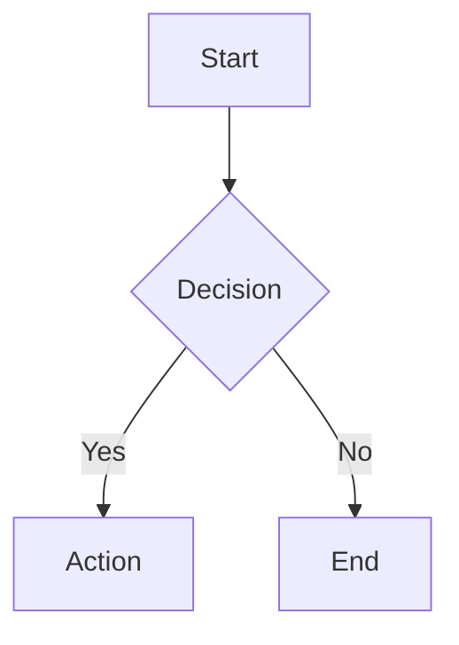

# AutoDown Editor Design

> **Version:** 1.0  
> **Depends on:** [UI Systems](./ui-systems.md), [Specs UI & Traceability](./spec-ui-and-relations.md)  
> **Status:** design

---

## 1. Design Goals

1. **WYSIWYG Block-Based Editing**: Replace the current split-pane (textarea + preview) editor with a single-pane, Notion-like block editor where each paragraph, heading, list, code block, and custom element is a distinct block.
2. **Pure Markdown First, AutoDown Second**: Phase 1 delivers full CommonMark/GFM support via Tiptap. Phase 2 layers AutoDown-specific blocks (callouts, math, diagrams, spec references) as extensions.
3. **Vue-Native Custom Blocks**: Every custom block type renders as a real Vue component via Tiptap's `VueNodeViewRenderer`, enabling reactive UIs inside the editor.
4. **Bidirectional Markdown Sync**: The editor's internal ProseMirror document serializes to clean Markdown on save and parses Markdown on load. No separate "source" mode required.
5. **Extensible by Default**: New block types (e.g., `MermaidBlock`, `SpecRefBlock`) are added by authoring a Tiptap Node extension + a Vue component — no core editor changes.

---

## 2. Architecture Decision

### 2.1 Why Tiptap?

| Criterion | Tiptap | Native ContentEditable | Other RTEs |
|---|---|---|---|
| **Headless** | ✅ No forced UI | N/A | ❌ Often styled |
| **Vue 3 Native** | ✅ `@tiptap/vue-3` with `VueNodeViewRenderer` | ⚠️ Manual | ⚠️ Wrappers needed |
| **Block Model** | ✅ ProseMirror native `group: 'block'` | ❌ Flat | ❌ Varies |
| **Markdown** | ✅ `@tiptap/markdown` with `marked`, per-extension `parseMarkdown`/`renderMarkdown` | ❌ Manual | ⚠️ Add-on |
| **Extension System** | ✅ `Node.create`, `Mark.create`, `Extension.create` | ❌ Ad-hoc | ⚠️ Plugin APIs |
| **Drag & Drop** | ✅ `extension-drag-handle` + `NodePos` API | ❌ Manual | ⚠️ Partial |
| **Community** | ✅ Large, active, novel.sh reference | N/A | Varies |

### 2.2 Design Influences

**Tiptap** (`D:\github\tiptap\`) provides the core engine:
- `Editor` class orchestrates `ExtensionManager`, `CommandManager`, and ProseMirror `Schema`/`EditorView`.
- Extensions declare `parseHTML`, `renderHTML`, `addNodeView`, `addCommands`, `addKeyboardShortcuts`, and **markdown hooks**: `parseMarkdown`, `renderMarkdown`, `markdownTokenizer`.
- `VueNodeViewRenderer` mounts Vue components inside ProseMirror's content DOM.

**Novel** (`D:\github\novel\`) provides the wrapper pattern:
- **Headless core**: Unstyled primitives (`EditorRoot`, `EditorContent`, `EditorBubble`, `EditorCommand`) that handle logic, state, and positioning.
- **Styled app layer**: Tailwind-styled selectors, slash commands, and bubble menus composed on top of headless primitives.
- **State**: Jotai atoms + `tunnel-rat` portals for floating UI (slash command menu).
- **Markdown**: `tiptap-markdown` for bidirectional parse/serialize, with utilities like `getAllContent()` returning markdown string.

### 2.3 AutoForge Adaptation

We adopt the **Novel wrapper pattern** but simplify it for Vue 3 composition API:
- No Jotai/tunnel-rat — use Vue's `provide`/`inject` and Teleport for floating UI.
- No `cmdk` — use a lightweight Vue composable for slash command filtering.
- Keep headless/styled separation: `AutoDownEditor` (headless core) + styled block components in the app.

---

## 3. Block-Based Document Model

### 3.1 ProseMirror Schema (Tiptap)

The document is a tree of **blocks**. Each block is a ProseMirror `Node` with `group: 'block'`.

```
Doc
├── Paragraph
│   └── inline* (text with marks: bold, italic, link, code)
├── Heading { level: 1..6 }
│   └── inline*
├── BulletList
│   └── ListItem
│       └── block+
├── OrderedList
│   └── ListItem
│       └── block+
├── CodeBlock { language: string? }
│   └── text*
├── Blockquote
│   └── block+
├── HorizontalRule
├── Image { src, alt, title, width?, height? }
├── Table
│   └── TableRow
│       └── TableCell
│           └── block+
└── ─── AutoDown Extensions (Phase 2) ───
    ├── Callout { type: "info" | "warning" | "tip" | "danger" }
    │   └── block+
    ├── MathBlock { expr: string }
    ├── MermaidBlock { diagram: string }
    ├── SpecRefBlock { id: string, title?: string }
    └── EmbedBlock { url: string, provider?: string }
```

### 3.2 Block Identity

Every block is addressable:
- **Position**: ProseMirror integer position (stable during edit session).
- **Node ID**: Optional `id` attribute for cross-reference stability (serialized as HTML `data-node-id`, stripped from Markdown).

---

## 4. Extension System

### 4.1 Extension = Tiptap Node + Vue Component

An AutoDown block extension is a **pair**:

1. **Tiptap Node Extension** — defines schema, parse/render rules, commands, and markdown hooks.
2. **Vue Block Component** — provides the interactive WYSIWYG rendering via `addNodeView()`.

```typescript
// extensions/callout.ts
import { Node } from '@tiptap/core'
import { VueNodeViewRenderer } from '@tiptap/vue-3'
import CalloutBlock from '../blocks/CalloutBlock.vue'

export const Callout = Node.create<CalloutOptions>({
  name: 'callout',
  group: 'block',
  content: 'block+',
  defining: true,

  addAttributes() {
    return {
      type: { default: 'info' },
      nodeId: { default: null },
    }
  },

  parseHTML() {
    return [{ tag: 'div[data-callout]' }]
  },

  renderHTML({ HTMLAttributes }) {
    return ['div', { 'data-callout': '', ...HTMLAttributes }, 0]
  },

  addNodeView() {
    return VueNodeViewRenderer(CalloutBlock)
  },

  addCommands() {
    return {
      setCallout: (attrs) => ({ commands }) =>
        commands.wrapIn('callout', attrs),
      toggleCallout: (attrs) => ({ commands }) =>
        commands.toggleWrap('callout', attrs),
    }
  },

  // ─── Markdown hooks ───
  parseMarkdown: (token, helpers) => {
    // Parse :::info syntax (custom tokenizer registered below)
    return helpers.createNode('callout', { type: token.type },
      helpers.parseChildren(token.tokens || [])
    )
  },

  renderMarkdown: (node, h) => {
    const type = node.attrs?.type || 'info'
    return `:::${type}\n${h.renderChildren(node.content)}\n:::`
  },

  markdownTokenizer: {
    name: 'callout',
    level: 'block',
    start: (src) => src.match(/^:::(\w+)/)?.index,
    tokenizer: (src, tokens) => {
      const match = src.match(/^:::(\w+)\n/)
      if (!match) return undefined
      const type = match[1]
      const endIndex = src.indexOf('\n:::', match[0].length)
      if (endIndex === -1) return undefined
      const body = src.slice(match[0].length, endIndex)
      return {
        type: 'callout',
        raw: src.slice(0, endIndex + 4),
        type,
        tokens: this.lexer.lex(body),
      }
    },
  },
})
```

```vue
<!-- blocks/CalloutBlock.vue -->
<template>
  <node-view-wrapper class="callout" :class="`callout--${props.node.attrs.type}`">
    <div class="callout-icon">
      <Info v-if="type === 'info'" />
      <AlertTriangle v-if="type === 'warning'" />
      <!-- ... -->
    </div>
    <div class="callout-content">
      <node-view-content />
    </div>
  </node-view-wrapper>
</template>

<script setup lang="ts">
import { nodeViewProps, NodeViewWrapper, NodeViewContent } from '@tiptap/vue-3'
const props = defineProps(nodeViewProps)
</script>
```

### 4.2 Extension Registry

Extensions are registered in a single array consumed by the editor:

```typescript
// extensions/index.ts
import StarterKit from '@tiptap/starter-kit'
import Placeholder from '@tiptap/extension-placeholder'
import Image from '@tiptap/extension-image'
import Link from '@tiptap/extension-link'
import TaskList from '@tiptap/extension-task-list'
import TaskItem from '@tiptap/extension-task-item'
import Markdown from '@tiptap/extension-markdown'

import { Callout } from './callout'
import { MathBlock } from './math-block'
import { MermaidBlock } from './mermaid-block'
import { SpecRef } from './spec-ref'
import { SlashCommand } from './slash-command'
import { BubbleMenu } from './bubble-menu'
import { DragHandle } from './drag-handle'
import { CustomKeymap } from './custom-keymap'

export function createExtensions(options: EditorOptions = {}) {
  return [
    // ─── Core ───
    StarterKit.configure({
      heading: { levels: [1, 2, 3] },
      codeBlock: false, // Use custom CodeBlock for language attr
    }),
    Placeholder.configure({ placeholder: "Type '/' for commands…" }),
    Link.configure({ openOnClick: false }),
    Image.configure({ allowBase64: true }),
    TaskList,
    TaskItem.configure({ nested: true }),

    // ─── Markdown ───
    Markdown.configure({
      html: false,
      tightLists: true,
      bulletListMarker: '-',
      transformPastedText: true,
      transformCopiedText: true,
    }),

    // ─── UI Behaviors ───
    SlashCommand.configure({ suggestion: { items: getSlashItems } }),
    BubbleMenu,
    DragHandle,
    CustomKeymap,

    // ─── AutoDown Blocks (Phase 2) ───
    Callout,
    MathBlock,
    MermaidBlock,
    SpecRef,
  ]
}
```

---

## 5. Markdown / AutoDown Serialization

### 5.1 Philosophy

The editor's **source of truth** is the ProseMirror document (JSON). Markdown is the **persistence format**.

- **Load**: Markdown → `editor.commands.setContent(markdown, true, { parser: 'markdown' })`
- **Save**: `editor.storage.markdown.getMarkdown()` → send to backend
- **Copy/Paste**: Tiptap Markdown extension automatically transforms clipboard text.

### 5.2 Two-Phase Markdown Support

| Phase | Markdown Flavor | Blocks |
|---|---|---|
| **Phase 1** | CommonMark + GFM | Paragraph, Heading, List, CodeBlock, Blockquote, HR, Image, Link, Table, TaskList |
| **Phase 2** | AutoDown (GFM + extensions) | Phase 1 + Callout, MathBlock, MermaidBlock, SpecRef, Embed |

### 5.3 AutoDown Syntax Extensions

AutoDown extends Markdown with fenced directives:

```markdown
# Normal Markdown Works

## Callouts
:::info
This is an info callout with **rich** content.
:::

:::warning
Watch out! Nested lists work too:
- Item 1
- Item 2
:::

## Math
%{ x = {-b \pm \sqrt{b^2-4ac}} \over {2a} }%

## Mermaid


## Spec Reference
[[G1]]
[[A1|Custom Title]]
```

### 5.4 Custom Tokenizer Registration

Each AutoDown extension registers a `marked` tokenizer via Tiptap's `markdownTokenizer` hook. The `MarkdownManager` aggregates all tokenizers before parsing:

```typescript
// MarkdownManager pseudocode (Tiptap internal)
const tokenizers = extensions
  .map(ext => ext.config.markdownTokenizer)
  .filter(Boolean)

marked.use({ extensions: tokenizers })
```

This means **adding a new block type does not require modifying the markdown engine** — only the extension definition.

---

## 6. Component Architecture

### 6.1 Headless Core Components

These components contain zero styling. They provide logic, state, and event wiring.

```
components/editors/autodown/
├── core/
│   ├── AutoDownEditor.vue      # Main wrapper: creates Tiptap Editor instance
│   ├── EditorContent.vue       # Mounts ProseMirror view (thin wrapper)
│   ├── EditorBubble.vue        # Wraps Tiptap BubbleMenu, visibility logic
│   ├── EditorSlashMenu.vue     # Slash command list + filtering
│   ├── EditorDragHandle.vue    # Floating drag handle (Vue wrapper)
│   └── EditorProvider.vue      # provide()s editor instance to descendants
```

**`AutoDownEditor.vue`** (simplified):

```vue
<template>
  <div class="autodown-editor" :class="{ 'is-focused': focused }">
    <editor-content :editor="editor" />
    <editor-slash-menu v-if="slashMenuOpen" />
    <editor-bubble v-if="bubbleMenuOpen" />
    <editor-drag-handle />
  </div>
</template>

<script setup lang="ts">
import { useEditor, EditorContent } from '@tiptap/vue-3'
import { createExtensions } from '../extensions'

const props = defineProps<{
  content: string
}>()
const emit = defineEmits<{
  update: [markdown: string]
}>()

const editor = useEditor({
  extensions: createExtensions(),
  content: props.content,
  onUpdate: ({ editor }) => {
    emit('update', editor.storage.markdown.getMarkdown())
  },
})
</script>
```

### 6.2 Block Components (Vue Node Views)

Each block type that needs custom WYSIWYG rendering has a Vue component:

```
components/editors/autodown/blocks/
├── CalloutBlock.vue
├── CodeBlock.vue           # With language selector
├── ImageBlock.vue          # With resize handles
├── MathBlock.vue           # KaTeX rendered
├── MermaidBlock.vue        # Mermaid diagram rendered
├── SpecRefBlock.vue        # Clickable spec ID chip
├── EmbedBlock.vue          # URL preview / iframe
└── TableBlock.vue          # Column/row controls
```

### 6.3 Menu Components

```
components/editors/autodown/menus/
├── SlashMenu.vue           # "/" command palette
├── BubbleMenu.vue          # Text selection formatting bar
├── NodeMenu.vue            # Block type switcher (paragraph → heading → list)
└── LinkMenu.vue            # URL input popover
```

---

## 7. UI Features

### 7.1 Slash Commands (`/`)

Triggered by typing `/`. Filters blocks by title/description. Architecture:

1. **Tiptap Extension** (`slash-command.ts`): Uses `@tiptap/suggestion` to listen for `/`.
2. **Vue Composable** (`useSlashCommand.ts`): Maintains `query`, `range`, and `filteredItems` state.
3. **Menu Component** (`SlashMenu.vue`): Renders filtered list, handles keyboard navigation.

```typescript
// menus/slash-items.ts
export interface SlashItem {
  title: string
  description: string
  icon: Component
  searchTerms: string[]
  command: ({ editor, range }: { editor: Editor; range: Range }) => void
}

export const slashItems: SlashItem[] = [
  {
    title: 'Text',
    description: 'Just start writing with plain text.',
    icon: TextIcon,
    searchTerms: ['p', 'paragraph'],
    command: ({ editor, range }) => editor.chain().focus().deleteRange(range).setParagraph().run(),
  },
  {
    title: 'Heading 1',
    description: 'Big section heading.',
    icon: Heading1Icon,
    searchTerms: ['h1', 'title', 'big'],
    command: ({ editor, range }) => editor.chain().focus().deleteRange(range).setHeading({ level: 1 }).run(),
  },
  {
    title: 'Callout',
    description: 'Highlight information with an icon.',
    icon: AlertCircleIcon,
    searchTerms: ['callout', 'info', 'warning', 'tip'],
    command: ({ editor, range }) => editor.chain().focus().deleteRange(range).setCallout({ type: 'info' }).run(),
  },
  // ... more items
]
```

### 7.2 Bubble Menu

Appears on text selection. Hidden when:
- Selection is empty
- Selection is a node selection (drag handle territory)
- An image or custom block is selected

Contains: Bold, Italic, Code, Link, Strike, Text Color, Highlight Color.

### 7.3 Drag Handle

A floating handle on the left edge of each block:
- **Hover**: Handle appears next to the hovered block.
- **Drag**: Grabs the block (or nested group) and repositions it.
- **Click**: Selects the entire block (node selection).

Implementation: `tiptap-extension-global-drag-handle` or custom ProseMirror plugin using `@floating-ui/dom` for positioning.

### 7.4 Block Selection Keymap

Notion-like `Mod+a` behavior:
- **First press**: Select text within current node boundaries.
- **Second press**: Select entire document.

```typescript
// extensions/custom-keymap.ts
"Mod-a": ({ editor }) => {
  const { from, to } = editor.state.selection
  const $from = editor.state.doc.resolve(from)
  const nodeStart = $from.start()
  const nodeEnd = $from.end()

  const notExtended = from > nodeStart || to < nodeEnd
  if (notExtended) {
    editor.chain().selectTextWithinNodeBoundaries().run()
    return true
  }
  return false // Let default select-all run
}
```

---

## 8. Markdown-First Technical Strategy

### 8.1 Decision: Markdown as Native Format

We **do** support Markdown natively via `@tiptap/markdown` rather than treating it as an export-only format. Reasons:

1. **Tiptap's markdown extension is first-class**: Every core extension already implements `parseMarkdown`/`renderMarkdown`. No custom parser needed for Phase 1.
2. **Bidirectional sync is solved**: `editor.getMarkdown()` and `setContent(md, true, { parser: 'markdown' })` are built-in.
3. **AutoDown extends, not replaces**: Custom tokenizers layer on top of `marked`. Standard Markdown still parses correctly.
4. **Backend compatibility**: The existing backend stores `content: String` as Markdown. No migration needed.

### 8.2 When to Use ProseMirror JSON

Use ProseMirror JSON internally for:
- Clipboard operations within the editor (rich copy/paste).
- Real-time collaboration (if added later).
- AI diff/patch operations (more precise than text diff).

Persist to backend as Markdown only.

---

## 9. Implementation Phases

### Phase 1: Markdown WYSIWYG (Replace Current Editor)

**Goal**: Drop-in replacement for `MarkdownEditor.vue` with full Markdown support.

| Task | Files |
|---|---|
| Add Tiptap dependencies | `frontend/package.json` |
| Create `AutoDownEditor.vue` core | `components/editors/autodown/core/` |
| Implement slash commands | `extensions/slash-command.ts`, `menus/SlashMenu.vue` |
| Implement bubble menu | `menus/BubbleMenu.vue` |
| Integrate drag handle | `extensions/drag-handle.ts` |
| Style with CSS variables | Match existing `--af-*` token system |
| Replace `MarkdownEditor.vue` usage | `SpecsView.vue`, `WikiView.vue`, detail views |
| Add tests | Vitest: parse/serialize round-trip, command execution |

**Dependencies to add**:
```json
{
  "@tiptap/core": "^2.x",
  "@tiptap/vue-3": "^2.x",
  "@tiptap/starter-kit": "^2.x",
  "@tiptap/extension-placeholder": "^2.x",
  "@tiptap/extension-image": "^2.x",
  "@tiptap/extension-link": "^2.x",
  "@tiptap/extension-task-list": "^2.x",
  "@tiptap/extension-task-item": "^2.x",
  "@tiptap/extension-markdown": "^2.x",
  "@tiptap/suggestion": "^2.x",
  "@tiptap/extension-drag-handle": "^2.x",
  "tiptap-markdown": "^0.x"
}
```

### Phase 2: AutoDown Extensions

**Goal**: Add AutoDown-specific blocks that render as rich Vue components.

| Block | Extension | Vue Component | Markdown Syntax |
|---|---|---|---|
| **Callout** | `callout.ts` | `CalloutBlock.vue` | `:::type\n...\n:::` |
| **Math** | `math-block.ts` | `MathBlock.vue` | `%{ expr }%` |
| **Mermaid** | `mermaid-block.ts` | `MermaidBlock.vue` | ` ```mermaid ` |
| **SpecRef** | `spec-ref.ts` | `SpecRefBlock.vue` | `[[G1]]` or `[[G1|Title]]` |
| **Embed** | `embed-block.ts` | `EmbedBlock.vue` | `` with oEmbed |

### Phase 3: Advanced Editing

**Goal**: Polish and power-user features.

- Multi-column layout blocks
- Real-time collaborative cursors (Yjs + Tiptap Collaboration)
- AI-assisted writing (inline completion, similar to Novel's generative menu)
- Version diff view (compare two ProseMirror documents)

---

## 10. File Structure

```
frontend/src/components/editors/autodown/
├── index.ts                          # Public API exports
├── extensions/
│   ├── index.ts                      # createExtensions() factory
│   ├── slash-command.ts              # Suggestion engine for "/"
│   ├── bubble-menu.ts                # Bubble menu extension config
│   ├── drag-handle.ts                # Drag handle extension config
│   ├── custom-keymap.ts              # Notion-like keybindings
│   ├── callout.ts                    # (Phase 2) Callout node
│   ├── math-block.ts                 # (Phase 2) Math node
│   ├── mermaid-block.ts              # (Phase 2) Mermaid node
│   ├── spec-ref.ts                   # (Phase 2) Spec reference node
│   └── embed-block.ts                # (Phase 2) Embed node
├── blocks/
│   ├── CalloutBlock.vue
│   ├── CodeBlock.vue
│   ├── ImageBlock.vue
│   ├── MathBlock.vue
│   ├── MermaidBlock.vue
│   ├── SpecRefBlock.vue
│   └── EmbedBlock.vue
├── menus/
│   ├── SlashMenu.vue
│   ├── BubbleMenu.vue
│   ├── NodeMenu.vue
│   └── LinkMenu.vue
├── composables/
│   ├── useAutoDownEditor.ts          # Wrapper around useEditor()
│   ├── useSlashCommand.ts            # Slash menu state + filtering
│   └── useBlockSelection.ts          # Block-level selection helpers
└── styles/
    ├── autodown-editor.css           # Editor chrome styles
    ├── blocks.css                    # Block base styles
    └── prosemirror.css               # ProseMirror-specific overrides
```

---

## 11. Key Interfaces

### 11.1 Editor Props / Events

```typescript
// AutoDownEditor.vue
interface AutoDownEditorProps {
  content: string           // Markdown source
  placeholder?: string
  editable?: boolean
  autofocus?: boolean
}

interface AutoDownEditorEvents {
  'update': [markdown: string]     // Emitted on every change (debounced)
  'save': [markdown: string]       // Explicit save (Ctrl+S)
  'blur': []
  'focus': []
}
```

### 11.2 Slash Item API

```typescript
interface SlashItem {
  title: string
  description: string
  icon: Component
  searchTerms: string[]
  command: (ctx: { editor: Editor; range: Range }) => void
}
```

### 11.3 Block Component Props (Vue Node View)

```typescript
import { nodeViewProps } from '@tiptap/vue-3'
// Props injected by VueNodeViewRenderer:
// editor, node, decorations, selected, deleteNode, updateAttributes, getPos
```

### 11.4 Markdown Extension Contract

```typescript
interface MarkdownNodeConfig {
  markdownTokenName?: string
  parseMarkdown?: (token: Token, helpers: ParseHelpers) => JSONContent
  renderMarkdown?: (node: JSONContent, helpers: RenderHelpers) => string
  markdownTokenizer?: MarkdownTokenizer
}
```

---

## 12. Open Questions

1. **Table editing**: Use Tiptap's official `Table` extension or a custom Vue-based table block with column/row controls?
2. **Image upload**: Upload to backend API then insert URL, or support base64 inline (for small images)?
3. **Math rendering**: KaTeX (fast, limited) or MathJax (slower, more complete)? Both can be lazy-loaded.
4. **Mermaid rendering**: Render client-side with `mermaid` library (already in dependencies) or server-side to SVG?
5. **Collaboration**: Yjs integration for real-time multi-user editing — defer to Phase 3.
6. **Mobile**: Touch-friendly drag handle and bubble menu positioning.

---

## 13. References

| Project | Path | What We Learned |
|---|---|---|
| **Tiptap** | `D:\github\tiptap\` | Extension system (`Node.create`, `Mark.create`), `VueNodeViewRenderer`, `@tiptap/markdown` with `marked`, drag-handle plugin, schema generation from extensions. |
| **Novel** | `D:\github\novel\` | Headless core + styled app separation, Jotai/tunnel-rat for floating UI, slash command architecture with `@tiptap/suggestion`, `tiptap-markdown` integration, image resize with `react-moveable`. |
