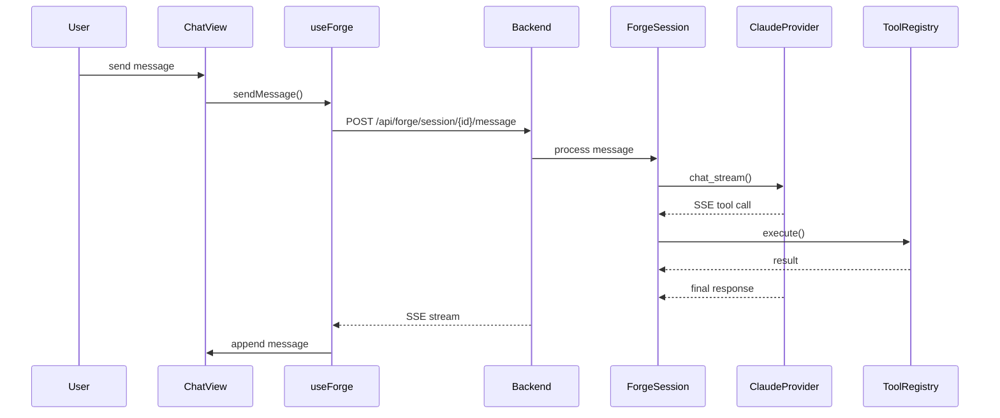
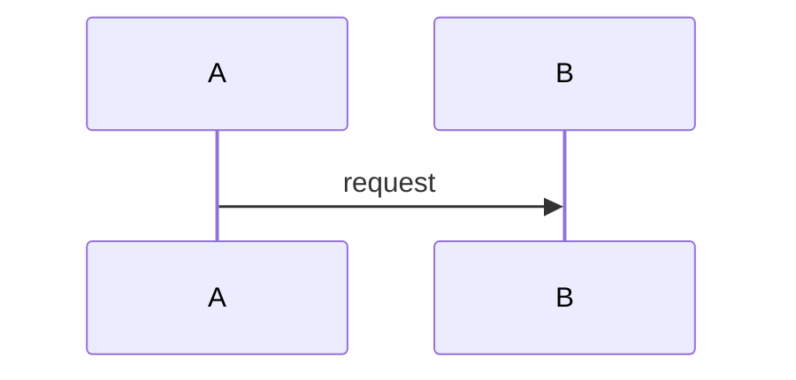

# Plan 014: 对比 CodeViewX 与 AutoForge Specs，优化架构文档生成

## 背景

我们使用 CodeViewX 为 auto-forge 项目生成了一套架构文档（位于 `./cvx/`），包含 5 个文件、约 3500 行中文技术文档。与此同时，我们自己的 specs 系统（`specs/auto-forge/`）也维护着 14 个模块、约 100+ 个 spec 条目。

本计划通过系统对比两者的差异，提取 CodeViewX 的可借鉴之处，改进 AutoForge 的 specs 生成流程、Architect 职业配置和相关技能。

---

## 一、CodeViewX 文档结构分析

CodeViewX 生成 5 个文件，形成从浅到深的文档层次：

| 文件 | 用途 | 深度 |  ours 对应物 |
|------|------|------|-------------|
| `README.md` | 总览+导航 | 项目级 | `overview.ad`（部分对应） |
| `01-overview.md` | 技术栈+目录结构+核心概念+数据流 | 项目级 | **缺失** |
| `02-quickstart.md` | 安装/配置/运行/FAQ | 项目级 | **缺失** |
| `03-architecture.md` | 4层架构+设计决策+扩展性 | 架构级 | `*/architecture.ad`（部分对应） |
| `04-core-mechanisms.md` | 5个核心流程的时序图+代码+数据流 | 实现级 | **缺失** |

### CodeViewX 的关键优势

1. **精确代码引用**：每个结论都引用实际代码，格式为 `文件:行号 | 描述`，并附带 10-20 行代码片段
2. **技术栈验证**：强制读取 `Cargo.toml`/`package.json` 验证依赖，禁止假设
3. **深度分析**：核心流程文档包含：概述→时序图(Mermaid)→详细步骤(触发条件/核心代码/数据流/关键点)→异常处理→设计亮点
4. **设计决策 rationale**：每个技术选型都有"为什么"的解释（如为什么用 Rust 而不是 Go）
5. **横向流程视角**：04-core-mechanisms.md 分析的是**跨模块流程**（Chat Loop、Relay Pipeline、Agent Turn），而不是单个模块的内部结构
6. **质量自检清单**：prompt 中内置完整性/准确性/可读性/实用性检查清单
7. **项目类型策略**：根据项目类型（Web/CLI/库/小项目）动态调整文档组合

---

## 二、AutoForge Specs 现状分析

### 当前结构（14 个模块）

```
specs/auto-forge/
├── manifest.at              # 模块清单
├── overview.ad              # 项目总览
├── agent-config/
│   ├── module.ad            # 模块索引（描述+spec计数+导航模板）
│   ├── goals.ad             # 目标
│   ├── architecture.ad      # 架构决策（ADR格式）
│   ├── designs.ad           # 设计规范
│   ├── plans.ad             # 实施计划
│   ├── tests.ad             # 验收测试
│   ├── reviews.ad           # 回顾
│   └── reports.ad           # 报告
├── api-sources/
├── autodown/
├── chat/
├── cli/
├── editor/
├── errand/
├── project/
├── provider/
├── relay/
├── runtime/
├── specs/
├── ui-system/
└── wiki/
```

### 当前优势

1. **模块化演进**：每个模块独立演进，适合大型项目长期维护
2. **金字塔追踪**：Goals → Architecture → Designs → Plans → Tests → Reviews → Reports，形成完整的决策-实施-验证闭环
3. **状态追踪**：每个 spec item 有 Status、Depends on、Tags 等元数据
4. **双向链接**：RelationsPanel、AutoLinkContent 实现 spec 间的双向跳转
5. **与 Relay 深度集成**：Architect 职业自动生成/更新 specs

### 当前差距

| 维度 | CodeViewX | AutoForge Specs | 差距等级 |
|------|-----------|-----------------|----------|
| **代码引用精度** | 文件路径+精确行号+10-20行代码 | 无直接代码引用 | 🔴 高 |
| **核心流程分析** | 5个跨模块流程，各有时序图+详细步骤 | 分散在各模块，无横向视角 | 🔴 高 |
| **技术栈验证** | 强制读取配置文件验证 | 依赖人工标注 | 🟡 中 |
| **设计决策深度** | 每个决策有"为什么"+trade-off表 | ADR有Decision/Trade-offs，但较简短 | 🟡 中 |
| **快速开始指南** | 详细的安装/配置/运行/FAQ | **缺失** | 🟡 中 |
| **模块概述深度** | 未生成（但 01-overview 有模块组织） | module.ad 仅描述+计数 | 🟡 中 |
| **质量自检** | prompt 内置清单 | 依赖 Architect 职业操守 | 🟡 中 |
| **数据模型文档** | 专门的 05-data-models.md | 分散在 Designs 中 | 🟢 低 |
| **API 文档** | 专门的 06-api-reference.md | 在 api-sources 模块中 | 🟢 低 |

---

## 三、关键差距详解

### 差距 1：module.ad 内容太单薄

**当前 `generate_module_overviews.py` 的输出：**

```markdown
# Relay Module

## Overview
Serial agent flows with baton passing and gate enforcement

## Module Specs
| Type | Count | File |
|------|-------|------|
| Goals | 15 | [goals.ad](goals.ad) |
...

## Navigation
This module follows the standard spec pyramid...

## ID Prefix
Spec IDs in this module use the prefix Relay-...
```

**问题：**
- 只有第一个 goal 的标题作为描述
- 没有组件清单
- 没有数据流入口/出口
- 没有与其他模块的交互关系
- 没有关键设计决策摘要
- 对新人来说，读完 module.ad 仍然不知道这个模块**具体做什么**

### 差距 2：overview.ad 缺少项目级技术细节

**当前 overview.ad 包含：**
- 项目简介（1段）
- Mermaid 架构图（3层）
- 模块索引表（14行）
- 导航指南
- ID 约定

**缺失：**
- 技术栈详细表格（框架、版本、用途）
- 项目目录结构展示
- 核心概念解释（如 "Soul"、"Profession"、"Relay"、"Gate"）
- 数据流概览
- 部署架构（dev vs production）

### 差距 3：缺少横向"核心流程"文档

我们的 specs 是**纵向模块化**的：每个模块独立描述自己的目标、架构、设计。

但像 **"Chat Loop"** 这样的流程跨越了：
- `chat/`（UI 组件）
- `relay/`（handoff、agent spawning）
- `provider/`（SSE 流式输出）
- `runtime/`（session persistence）

没有一个统一的文档描述这个完整流程的时序、数据流、关键代码。

CodeViewX 的 `04-core-mechanisms.md` 恰好弥补了这个空白。

### 差距 4：Architect / forge-write-architecture 缺少代码验证和质量约束

**CodeViewX prompt 中的关键约束（我们的系统缺少的）：**

1. **准确性至上**："绝对禁止捏造、推测、假设任何不确定的信息"
2. **技术栈验证**：必须先读取 `package.json`/`Cargo.toml` 再描述技术栈
3. **代码证据**：每个重要结论必须引用实际代码片段（文件路径+行号）
4. **深度优先**：核心流程要有时序图、数据流图、详细步骤分解
5. **质量自检清单**：完整性/准确性/可读性/实用性检查

**当前 Architect soul 的要求：**
- 读取现有 specs（最多3次）
- 用 `update_spec` 写 Architecture/Designs
- 更新 overview.ad
- 每个设计包含 interface、state machine、data model
- 不批准没有错误处理的设计

**差距：**
- 没有要求 Architect 在写 Architecture 之前**先读取源代码验证**
- 没有要求引用**实际代码片段**
- 没有要求生成**时序图/数据流图**
- 没有**质量自检清单**
- 没有区分"项目类型"的不同文档策略

---

## 四、改进计划

### Phase 1：增强模块概述生成（backend/scripts 层）

#### 1.1 重写 `generate_module_overviews.py`

**目标：** 从模块的所有 spec 文件中提取更多结构化信息，生成更丰富的 `module.ad`。

**新增提取内容：**
- **关键组件清单**：从 designs.ad 中提取提到的组件/struct/interface 名称
- **关键数据结构**：从 designs.ad 中提取 data model 名称
- **模块间依赖**：从 architecture.ad 的 `Depends on` 和其他模块的交叉引用中推导
- **入口/出口**：从 designs.ad 中提取 API 端点、事件类型、工具名称
- **关键决策摘要**：从 architecture.ad 中提取 Decision 字段的前两句

**生成格式示例：**

```markdown
# Relay Module

## Overview
Serial agent flows with baton passing and gate enforcement.

## Key Components
- `PipelineEngine` — deterministic state machine for flow execution
- `HandoffManager` — generates handoff documents between agents
- `CheckpointManager` — serializes/resumes pipeline state
- `BudgetTracker` — tracks token consumption per run

## Data Flow
- **Input**: FlowSpec YAML, profession definitions, spec ledger
- **Output**: Handoff documents, checkpoints, SSE events, gate requests
- **Events**: `RelayStart`, `TurnStart`, `ToolCall`, `Handoff`, `GatePause`, `Completed`

## Key Decisions
- **Deterministic Rust orchestrator** (not LLM-based) for zero-token coordination
- **JSON + git checkpoints** for crash recovery without chat history

## Module Specs
...
```

#### 1.2 增强 `overview.ad` 模板

**目标：** 让 overview.ad 包含更多项目级技术信息。

**新增内容：**
- **技术栈总览表格**：框架、版本、用途（读取 `Cargo.toml` 和 `package.json` 自动生成）
- **项目目录结构**：树形展示（可用 `tree -L 2` 输出格式化）
- **核心概念表**：
  | 概念 | 含义 | 所在模块 |
  |------|------|----------|
  | Soul | Agent 人格定义 | agent-config |
  | Profession | Agent 职责与工具权限 | agent-config |
  | Relay | 串行 agent 流水线 | relay |
  | Gate | 人工审批关卡 | relay |
  | Handoff | Agent 间交接文档 | relay |
  | Spec | 结构化需求文档 | specs |
- **部署架构**：dev mode（backend :3031 + frontend :5173）vs production（backend serves static dist）
- **数据流概览**：简要说明 Chat Loop 和 Relay Pipeline 的数据流向

**实施方式：**
- 更新 `backend/src/forge/templates/overview.ad` 模板
- 或新增 Python 脚本 `regenerate_overview.py` 自动从代码和 specs 中提取信息

### Phase 2：新增横向"核心流程"文档层（specs 结构层）

#### 2.1 新增 `flows.ad` 文件类型

**目标：** 在项目根级别维护跨模块的核心流程文档。

**放置位置：**
- `specs/auto-forge/flows.ad`（项目级，描述所有核心流程）
- 或每个模块下新增 `flows.ad`（描述该模块参与的核心流程片段）

**推荐：项目级 `flows.ad`**

```markdown
# Core Flows

## Flow-1: Chat Loop (Forge)
**Modules involved**: chat, provider, runtime
**Entry**: User sends message in ChatView
**Exit**: SSE stream delivers assistant response

### Sequence Diagram


### Key Code References
- `backend/src/forge/mod.rs:680-750` — message processing loop
- `backend/src/provider/claude.rs:120-180` — SSE streaming

## Flow-2: Relay Pipeline Execution
**Modules involved**: relay, provider, runtime, specs
...
```

**与现有 specs 的关系：**
- `flows.ad` 是**横向视角**，描述"流程如何穿越模块"
- 各模块的 `architecture.ad`/`designs.ad` 是**纵向视角**，描述"模块内部如何工作"
- 两者互补，通过 ID 链接（如 `Flow-1` 引用 `Relay-A1`、`Chat-D3`）

#### 2.2 更新 manifest.at 格式

```
project auto-forge
module agent-config
module api-sources
...
flow core-chat-loop
flow core-relay-pipeline
flow core-agent-turn
flow core-spec-lifecycle
flow core-gate-approval
```

### Phase 3：增强 Architect 职业配置（soul + skill 层）

#### 3.1 增强 Architect Soul

**文件：** `backend/src/relay/souls/architect.md`

**新增内容：**

```markdown
## Code Verification Mandate
Before writing any Architecture or Designs spec that references source code:
1. **Verify tech stack**: Read `Cargo.toml` (backend) and `package.json` (frontend) to confirm dependencies and versions
2. **Verify file existence**: Use `dispatch` with `agent="gofer"` to confirm file paths and line numbers
3. **Cite code evidence**: Every structural conclusion must reference actual code with format:
   - `backend/src/forge/mod.rs:2024-2076` — session creation
   - `frontend/src/composables/useForge.ts:45-60` — message sending

## Depth Requirements
For every core mechanism described in Architecture:
- Include a Mermaid sequence diagram or data flow diagram
- Include a "Trigger Condition" explaining when this mechanism executes
- Include a "Data Flow" section: [input] → [processing] → [output]
- Include at least one design highlight explaining "why this design"

## Quality Checklist (self-check before handoff)
- [ ] All tech stack claims verified against config files
- [ ] All file paths and line numbers confirmed by gofer
- [ ] Every Architecture item has a Mermaid diagram
- [ ] Every core mechanism has a sequence diagram
- [ ] Every decision has a Trade-offs table with ≥2 alternatives
- [ ] All class/function names match actual code (not imagined)
```

#### 3.2 增强 `forge-write-architecture` Skill

**文件：** `~/.claude/skills/forge-write-architecture/SKILL.md`

**新增内容：**

```markdown
## Enhanced ADR Template

```markdown
### A1 <Title>
**Status:** Draft
**Scope:** G1
**Decision:** <what was chosen and why, in one sentence>

**Rationale:**
<why this decision was made, ≤300 words>

**Sequence Diagram:**


**Components:**


**Code Evidence:**
```rust
// File: backend/src/relay/pipeline.rs | Lines: 120-140
pub struct PipelineEngine { ... }
```

**Trade-offs:**
| Approach | Pros | Cons |
|---|---|---|
| <chosen> | ... | ... |
| <alternative A> | ... | ... |
| <alternative B> | ... | ... |

**Consequences:**
- Positive: ...
- Negative: ...

**Depends on:** G1
```

## New Rules
7. **Every Architecture item must include a Sequence Diagram** for dynamic behavior, in addition to the structural Component Diagram.
8. **Every Architecture item must cite at least one code reference** (file path + line range) if it describes existing code.
9. **Data Flow section is required** for items describing runtime behavior: [input] → [processing] → [output].
10. **Design Highlight section is required**: explain "why this design" in 1-2 sentences.
```

### Phase 4：新增 `forge-analyze-codebase` 技能（可选，高价值）

**目标：** 创建一个专门用于从代码库中提取架构信息的技能，供 Architect 在写 specs 之前使用。

**文件：** `~/.claude/skills/forge-analyze-codebase/SKILL.md`

```markdown
# Forge Analyze Codebase

Analyze a codebase to extract structured architectural information for spec writing.

## When to Use
- Before writing Architecture specs for a new module
- When onboarding a new module into the spec system
- When the codebase has drifted from existing specs

## Input Priority Order
1. Config files (`Cargo.toml`, `package.json`, `pyproject.toml`...)
2. `README.md`, `docs/`
3. Source directories (`src/`, `lib/`, `app/`) core modules
4. Test files

## Search Patterns
- Entry points: `main`, `if __name__`, `func main`, `@SpringBootApplication`
- Classes/interfaces: `class `, `interface `, `struct `, `type `
- Routes/API: `@app.route`, `router\.`, `async fn.*->.*Response`
- Database/Models: `model`, `schema`, `#[derive]`

## Output Format

```markdown
## Tech Stack Verification
| Technology | Version | Source | Confirmed |
|------------|---------|--------|-----------|
| axum | 0.8 | Cargo.toml | ✅ |

## Module Structure
| File | Lines | Purpose |
|------|-------|---------|
| `src/forge/mod.rs` | 2800 | Chat loop, session management |

## Key Data Structures
| Name | File | Lines | Fields |
|------|------|-------|--------|
| `ForgeSession` | `src/forge/mod.rs` | 150-180 | id, project, messages |

## API Surface
| Endpoint | Method | File | Lines |
|----------|--------|------|-------|
| `/api/forge/session` | POST | `src/forge/mod.rs` | 2024-2076 |

## Core Flows Detected
1. **Chat Loop**: `create_forge_session` → `send_forge_message` → `chat_stream` → SSE
2. **Relay Pipeline**: `PipelineEngine::advance` → `AgentInstance::turn` → `HandoffDocument`
```

## Rules
1. **Accuracy first**: Only describe content actually read from files. Mark uncertain items with `**待确认**`.
2. **No fabrication**: Do not invent file paths, line numbers, or class names.
3. **Verify before claiming**: Read `Cargo.toml`/`package.json` before describing tech stack.
```

### Phase 5：后端工具增强（backend 层）

#### 5.1 为 Architect 新增 `analyze_codebase` 工具

**目标：** 让 Architect agent 可以直接调用工具获取代码分析结果，而不需要 dispatch gofer。

**实现思路：**
- 在 `backend/src/forge/tools.rs` 中新增 `analyze_codebase` 工具
- 接受参数：`module`（可选，限定分析范围）
- 返回：
  - 该模块的关键文件列表
  - 关键 struct/enum/fn 名称和位置
  - API 端点列表
  - 依赖的其他模块

**技术实现：**
- 可以集成 `tree-sitter` 做轻量级 AST 解析
- 或者简单用 `ripgrep` + 正则（类似 CodeViewX 的做法）
- 返回结构化 JSON，LLM 可以直接消费

**优先级：** 中（Phase 4 的技能可以用现有的 `read_file` + `shell` + `search` 工具模拟，不需要立即实现新工具）

---

## 五、实施优先级

| Phase | 任务 | 影响 | 工作量 | 优先级 |
|-------|------|------|--------|--------|
| 1.1 | 重写 `generate_module_overviews.py` | module.ad 质量提升 | 小 | P0 |
| 1.2 | 增强 `overview.ad` 模板 | 项目总览信息丰富 | 小 | P0 |
| 3.1 | 增强 Architect Soul | Architecture 深度提升 | 小 | P0 |
| 3.2 | 增强 `forge-write-architecture` Skill | ADR 模板增强 | 小 | P0 |
| 2.1 | 新增 `flows.ad` | 横向流程视角 | 中 | P1 |
| 2.2 | 更新 `manifest.at` 格式 | 支持 flow 类型 | 小 | P1 |
| 4 | 新增 `forge-analyze-codebase` Skill | 代码分析前置 | 小 | P1 |
| 5.1 | 新增 `analyze_codebase` 工具 | 自动化代码分析 | 中 | P2 |

---

## 六、预期效果

实施后，AutoForge 的 specs 系统将具备：

1. **更丰富的 module.ad**：新人读完 module.ad 就能理解模块的组件、数据流、关键决策
2. **更完整的 overview.ad**：包含技术栈、目录结构、核心概念、部署架构
3. **横向流程视角**：`flows.ad` 补充纵向模块化结构的不足，形成"矩阵式"文档结构
4. **更高的 Architecture 质量**：Architect 被强制要求代码验证、时序图、数据流、设计亮点
5. **更强的准确性**：减少"凭想象命名"或"假设技术栈"的错误

最终目标是：**让 AutoForge 的 specs 既保持模块化管理的优势，又具备 CodeViewX 式深度分析的能力。**
